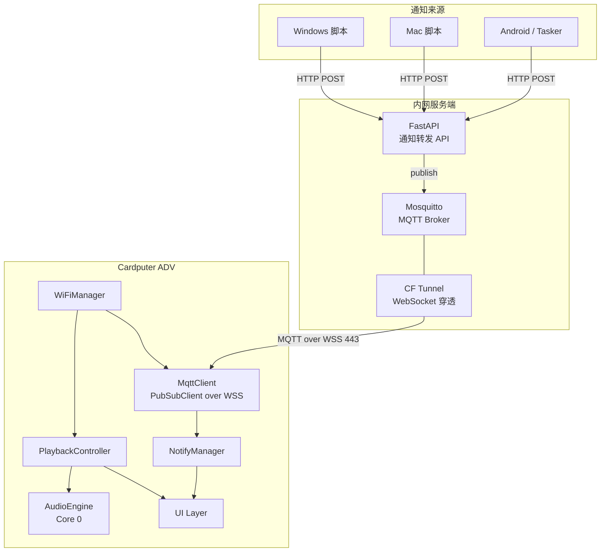
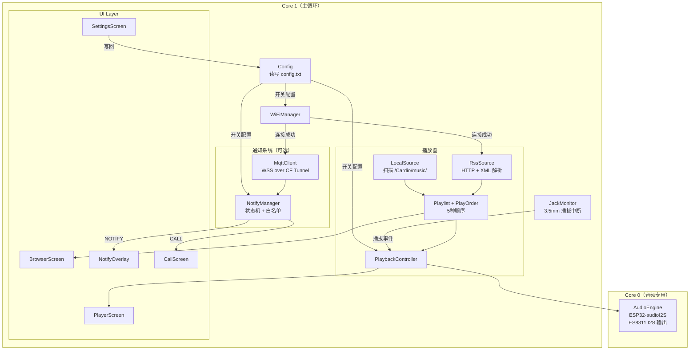
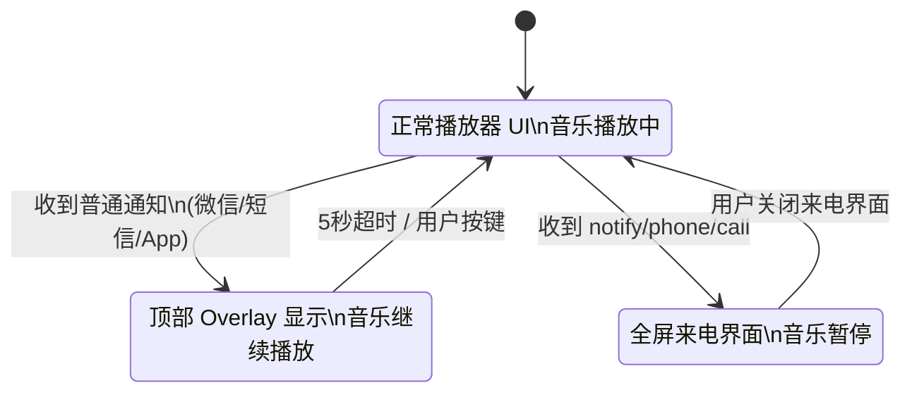
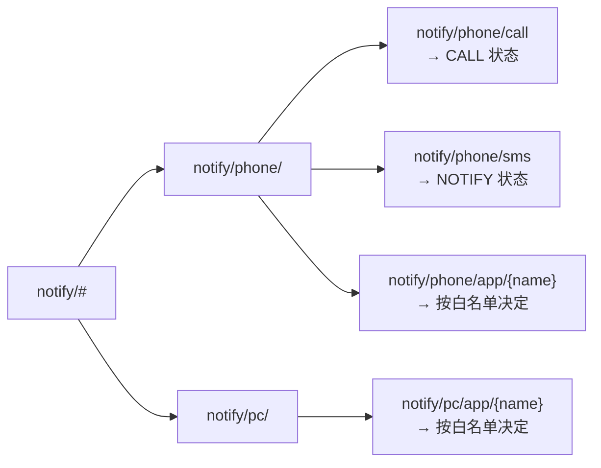
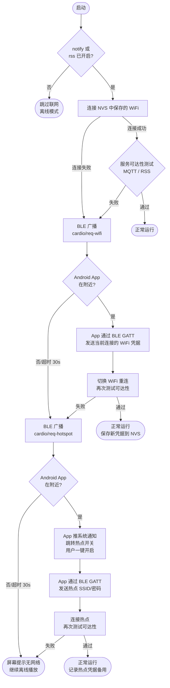
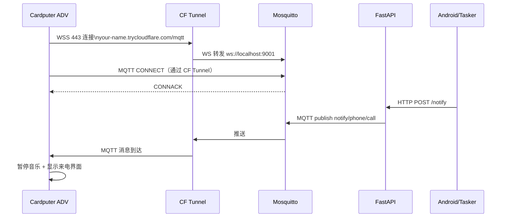

# Cardio — 系统架构

## 硬件平台

M5Stack Cardputer ADV
- 主控：ESP32-S3FN8（双核 240MHz，8MB PSRAM）
- 音频：ES8311 编解码器 → NS4150B 功放 → 1W 扬声器 / 3.5mm 耳机
- 显示：1.14" LCD 240×135
- 输入：56 键键盘
- 存储：MicroSD 卡槽

---

## 系统总览



---

## 固件内部架构



---

## 通知状态机



---

## MQTT Topic 结构



---

## WiFi 网络回退流程（Android 专属）

> 仅在 `notify_enabled=true` 或 `rss_enabled=true` 时生效。
> 两者均关闭时跳过整个流程，设备不尝试联网。

**"连不上"的判定标准：应用层可达性，而非 WiFi 关联状态。**
- notify 开启时：尝试 TCP 连接 MQTT 服务器（5s 超时）
- rss 开启时：尝试 HTTP HEAD 请求第一条 RSS URL（5s 超时）
- 以上任一失败即视为"连不上"



**BLE GATT 新增信号（扩展现有配网服务）：**

```
Service 0xFF00（沿用）
  ├── 0xFF03  Status NOTIFY（设备 → 手机）
  │           新增值：
  │           "req-wifi"    → 请求当前 WiFi 凭据
  │           "req-hotspot" → 请求开启热点
  │           "connected"   → 连接成功
  │           "failed"      → 连接失败
  ├── 0xFF01  SSID     WRITE（手机 → 设备，沿用）
  └── 0xFF02  Password WRITE ENCRYPTED（手机 → 设备，沿用）
```

**iOS / macOS / Windows 客户端行为：**
收到 `req-wifi` 或 `req-hotspot` 信号时忽略，不做任何响应。

---

## 网络连接路径



---

## SD 卡目录结构

```
SD 根目录/
└── Cardio/
    ├── music/
    │   ├── {播放列表名}/       ← 每个子文件夹 = 一个播放列表
    │   │   ├── *.flac
    │   │   └── *.mp3
    │   └── *.mp3               ← 根目录散文件归入默认列表
    ├── config.txt
    ├── rss_feeds.txt
    └── notify_filter.txt
```

**config.txt：**
```ini
# WiFi
wifi_ssid=MyNetwork
wifi_pass=password123

# MQTT
mqtt_host=your-name.trycloudflare.com
# mqtt_port=443        # 可选，默认 443；使用 frp 等工具时填写实际端口
mqtt_path=/mqtt
mqtt_user=cardio
mqtt_pass=yourpassword

# 功能开关
notify_enabled=true
rss_enabled=true

# 播放器
default_volume=15
default_order=sequential
```

**rss_feeds.txt：**
```
硬核节目|https://feeds.example.com/hardcore.xml
英语听力|https://feeds.example.com/english.xml
```

**notify_filter.txt：**
```
微信=show
短信=show
支付宝=show
微博=drop
```

---

## 服务端部署结构

```
server/
├── docker-compose.yml
├── mosquitto/
│   └── mosquitto.conf      # 开启 WebSocket listener 9001
└── api/
    ├── main.py             # FastAPI 接收 HTTP POST → 转发 MQTT
    └── requirements.txt
```

**CF Tunnel 路由：**
```yaml
ingress:
  - hostname: your-name.trycloudflare.com
    path: /mqtt
    service: ws://localhost:9001
  - service: http_status:404
```

---

## 依赖库

| 库 | 用途 | 阶段 |
|---|---|---|
| M5Cardputer | 硬件初始化、键盘、ES8311 | 全程 |
| ESP32-audioI2S | 音频解码 + I2S 输出 + ID3 回调 | 全程 |
| M5GFX | 屏幕绘图 | 全程 |
| SD / FS | 文件系统 | 全程 |
| arduinoWebSockets | WebSocket 传输层 | Week 3 |
| PubSubClient | MQTT 客户端 | Week 3 |
| ArduinoJson | 解析通知 JSON | Week 3 |
| HTTPClient | 拉取 RSS XML（ESP32 内置） | Week 3 |
| TJpgDec | 封面 JPEG 解码 | Week 5 |
| Preferences | NVS 断电续播 | Week 5 |
| Wire | I2C 写 ES8311 寄存器 | Week 1 |
