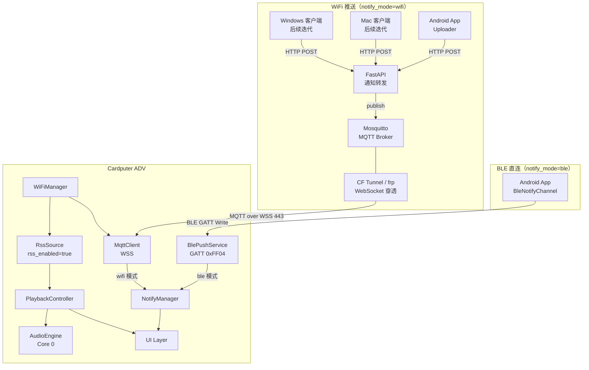
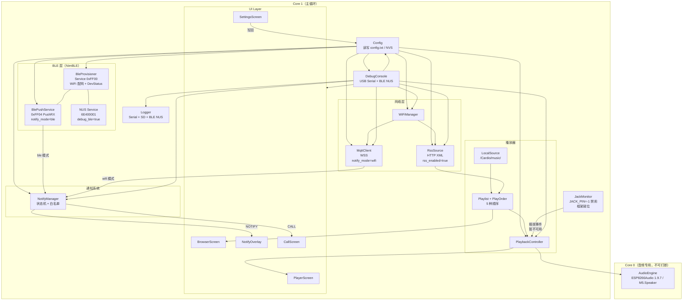
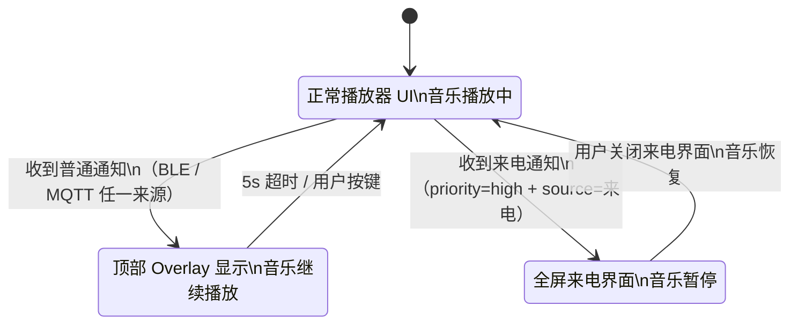
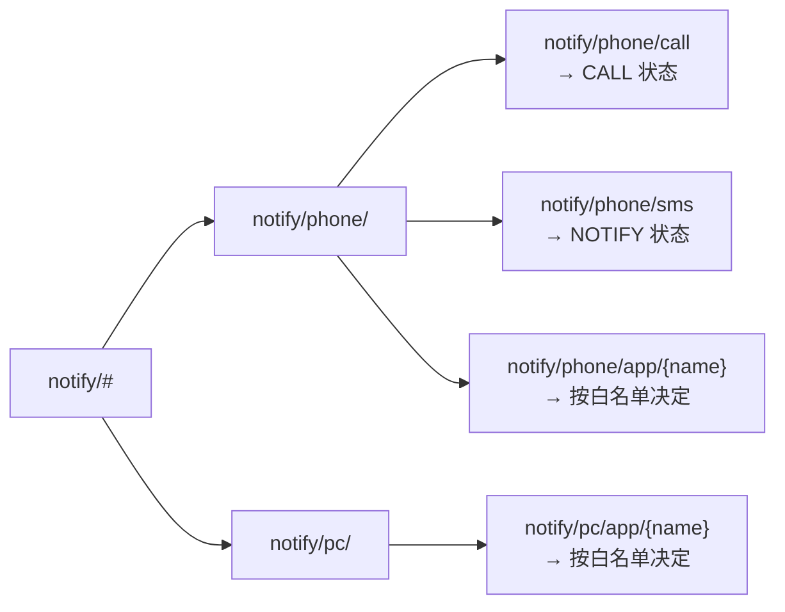
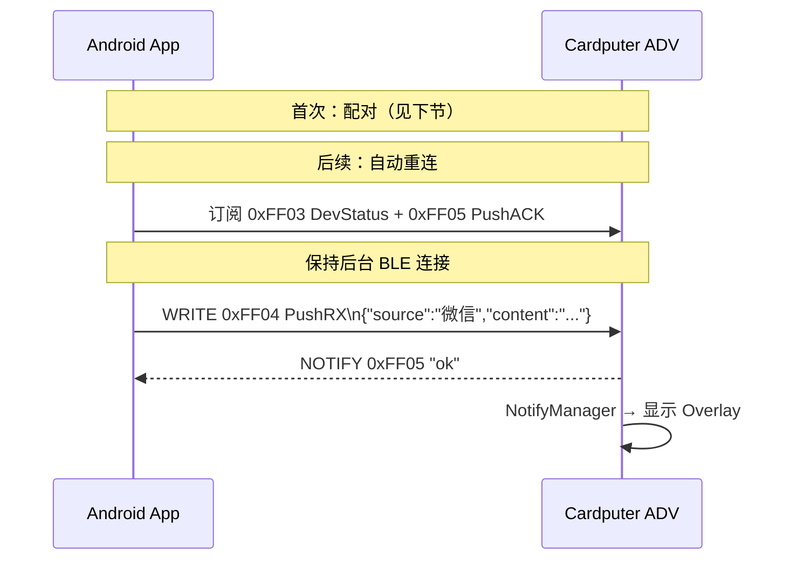
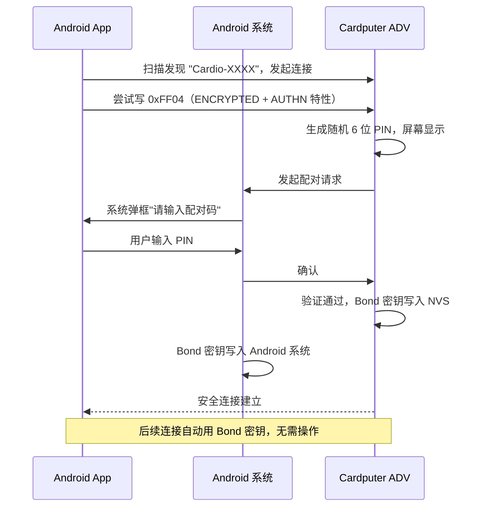
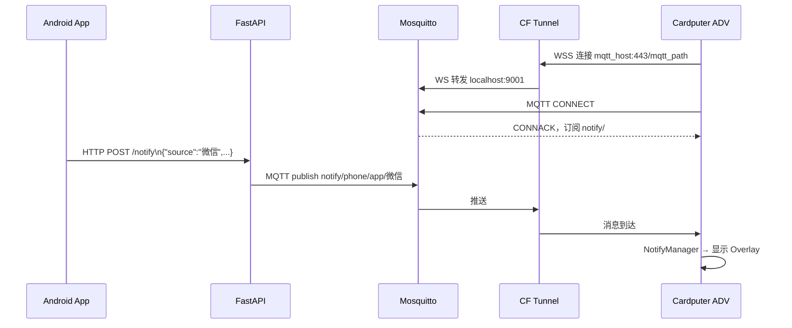
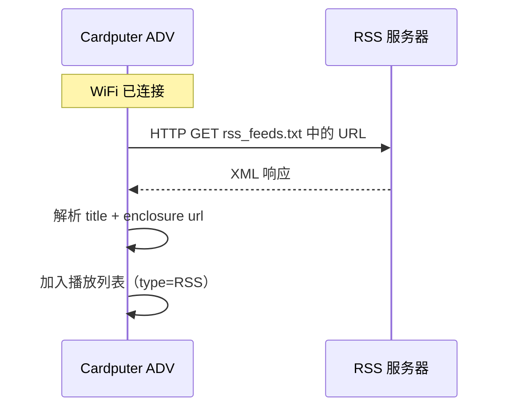
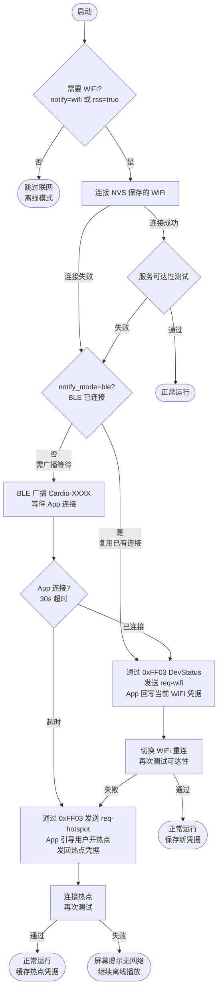
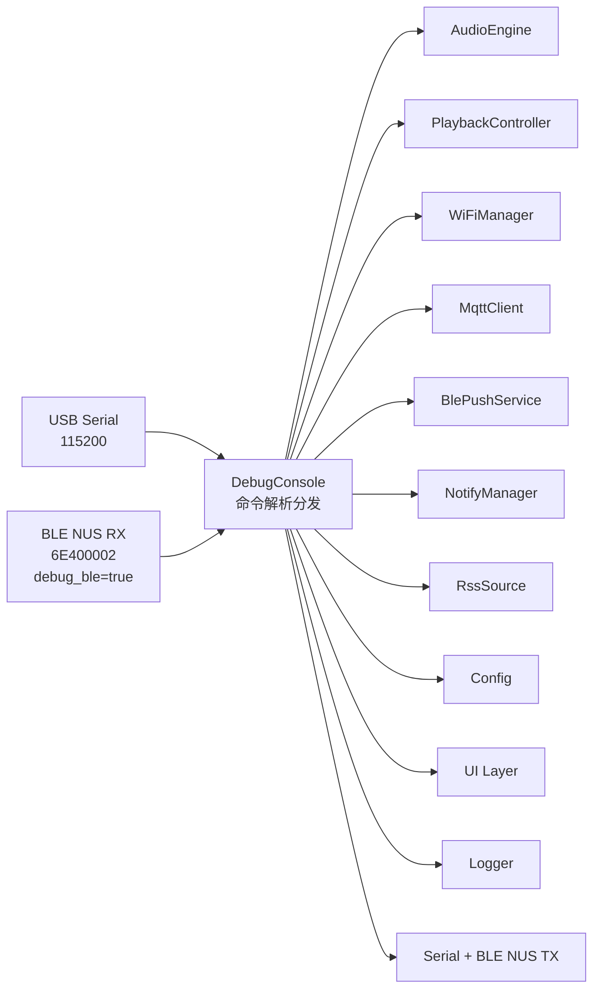

# Cardio — 系统架构

## 硬件平台

M5Stack Cardputer ADV
- 主控：ESP32-S3FN8（双核 240MHz，8MB OPI PSRAM）
- 音频：ES8311 编解码器 → NS4150B 功放 → 1W 扬声器 / 3.5mm 耳机
- 显示：1.14" LCD 240×135
- 输入：56 键键盘
- 存储：MicroSD 卡槽
- 无线：WiFi 802.11 b/g/n + BLE 5.0（无 Classic BT）

---

## 系统总览



---

## 固件内部架构



---

## 通知状态机



---

## 推送消息格式（BLE / WiFi 统一）

```json
{
  "source": "微信",
  "content": "张三: 你在吗",
  "priority": "normal",
  "timestamp": 1748000000
}
```

来电固定 `priority=high`，`source=来电`，`content` 为来电号码/姓名。

---

## MQTT Topic 结构（notify_mode=wifi 专用）



---

## 通知推送渠道

### 三种模式对比

| `notify_mode` | 原理 | 依赖 | 适用场景 |
|---|---|---|---|
| `off`（默认） | 不接收推送 | 无 | 纯音乐播放 |
| `ble` | 手机直连 BLE，写 GATT 0xFF04 | BLE，无需 WiFi 和服务器 | 近距离，简单部署 |
| `wifi` | MQTT over WSS → CF Tunnel / frp | WiFi + 服务端 | 远程推送，多平台 |

两种模式互斥，启动时根据配置初始化对应模块，另一个完全不启动。

---

### BLE 直连推送（notify_mode=ble）

**GATT 服务布局：**

```
Service 0xFF00（Cardio Main Service）
  ├── 0xFF01  SSID        WRITE                WiFi 配网：写入 SSID
  ├── 0xFF02  Password    WRITE | ENC          WiFi 配网：写入密码（加密）
  ├── 0xFF03  DevStatus   NOTIFY               设备 → 手机状态
  │           "req-wifi" | "req-hotspot" | "connected" | "failed"
  ├── 0xFF04  PushRX      WRITE | ENC | AUTHN  手机 → 设备（通知 JSON）
  └── 0xFF05  PushACK     NOTIFY               设备 → 手机（"ok" | "busy"）

Service 6E400001（NUS，debug_ble=true 时启用）
  ├── 6E400002  RX  WRITE   调试命令输入
  └── 6E400003  TX  NOTIFY  调试输出
```

**连接与推送流程：**



---

### BLE 配对机制

**方式：Passkey Entry（MITM 保护 + LE Secure Connections）**



| Bond 场景 | 处理 |
|---|---|
| 换手机 / 重新配对 | SettingsScreen → 清除配对 → `NimBLEDevice::deleteAllBonds()` |
| 调试清除 | DebugConsole `ble unpair` |
| 多台手机 | NimBLE 默认支持多 Bond |
| 固件重刷 | NVS 保留 Bond；`ble unpair` 手动清除 |
| Android 重连异常 | App 设置页"重新配对"→ `device.removeBond()`（反射调用） |

---

### WiFi 推送（notify_mode=wifi）

**连接与推送路径：**



---

### RSS（rss_enabled=true，WiFi 独有）



RSS 不支持 BLE 模式（数据量大，BLE 吞吐不足）。

---

## WiFi 网络回退流程（Android 专属）

> 触发条件：`notify_mode=wifi` 或 `rss_enabled=true`（需要 WiFi）。
> 两者均关闭时跳过，设备不尝试联网。

**"连不上"判定：应用层可达性，非 WiFi 关联状态。**
- `notify_mode=wifi`：TCP 连接 MQTT 服务器（5s 超时）
- `rss_enabled=true`：HTTP HEAD 第一条 RSS URL（5s 超时）



---

## SD 卡目录结构

```
SD 根目录/
└── Cardio/
    ├── music/
    │   ├── {播放列表名}/       ← 每个子文件夹 = 一个播放列表
    │   │   ├── *.flac / *.mp3
    │   └── *.mp3               ← 散文件归入默认列表
    ├── logs/                   ← 自动创建，调试日志
    ├── config.txt
    ├── rss_feeds.txt
    ├── notify_filter.txt
    ├── splash.gif              ← 可选，开屏动画（优先）
    └── splash.jpg              ← 可选，开屏静态图 240×135 JPEG（GIF 不存在时回退）
```

**config.txt：**
```ini
# WiFi
wifi_ssid=MyNetwork
wifi_pass=password123

# MQTT（notify_mode=wifi 时填写）
mqtt_host=your-name.trycloudflare.com
# mqtt_port=443        # 可选，默认 443；frp 等工具填实际端口
mqtt_path=/mqtt
mqtt_user=cardio
mqtt_pass=yourpassword

# 功能开关
notify_mode=off       # off | ble | wifi（默认 off）
rss_enabled=false     # false | true，仅 wifi 模式（默认 false）

# 调试
debug_enabled=false   # true 时启用调试控制台（Serial + BLE NUS）
debug_ble=false       # true 时额外开启 BLE NUS 通道（需 debug_enabled=true）
log_level=info        # debug | info | warn | error

# 播放器
default_volume=15
default_order=sequential
```

**rss_feeds.txt：**
```
硬核节目|https://feeds.example.com/hardcore.xml
英语听力|https://feeds.example.com/english.xml
```

**notify_filter.txt：**
```
微信=show
短信=show
支付宝=show
微博=drop
```

---

## 服务端部署（notify_mode=wifi 时才需要）

```
server/
├── docker-compose.yml
├── mosquitto/
│   └── mosquitto.conf      # listener 1883 + listener 9001 websockets
└── api/
    ├── main.py             # FastAPI：HTTP POST → MQTT publish
    └── requirements.txt
```

**CF Tunnel 路由：**
```yaml
ingress:
  - hostname: your-name.trycloudflare.com
    path: /mqtt
    service: ws://localhost:9001
  - service: http_status:404
```

---

## 调试控制台与日志系统

### Logger

```cpp
LOG_D("AUDIO", "Buffer: %d/%d", used, total);
LOG_I("WIFI",  "Connected: %s", ssid);
LOG_W("MQTT",  "Reconnecting, attempt %d", n);
LOG_E("RSS",   "Parse failed: %s", url);
```

输出格式：`[000123456][INFO ][WIFI ] Connected: MyNetwork`

| 输出目标 | 条件 |
|---|---|
| Serial（USB CDC 115200） | 始终 |
| SD `/Cardio/logs/cardio.log` | `debug_enabled=true` |
| BLE NUS TX | `debug_ble=true` 且已连接 |

日志超 512KB 自动轮转，保留 3 个文件。

---

### DebugConsole



**完整命令集：**

```
── 播放 ────────────────────────────────
play <路径>              播放指定文件
pause / resume           暂停 / 恢复
stop / next / prev       停止 / 切曲
volume <0-21>            音量
seek <秒>                跳转
status                   当前播放状态

── 播放列表 ────────────────────────────
list                     列出所有播放列表
playlist <名称>          切换播放列表
tracks                   列出曲目
order <模式>             切换播放顺序

── 网络 ────────────────────────────────
wifi status / connect    WiFi 状态 / 强制重连
mqtt status              MQTT 连接状态（wifi 模式）
mqtt pub <topic> <内容>  发布测试消息

── 通知模拟 ────────────────────────────
notify <来源> <内容>     模拟普通通知
call <姓名>              模拟来电

── BLE ─────────────────────────────────
ble status               BLE 连接状态
ble unpair               清除所有 Bond

── RSS ─────────────────────────────────
rss refresh              强制刷新
rss list                 列出已拉取节目

── 日志 ────────────────────────────────
log level <级别>         debug | info | warn | error
log dump                 输出日志文件
log clear                清空日志

── 系统 ────────────────────────────────
heap                     SRAM / PSRAM 剩余
battery                  电池电压和百分比
jack                     3.5mm 插拔状态
config get <key>         读取配置项
config set <key> <val>   修改配置（写回 NVS）
ui <screen>              强制切换界面
screen <on|off>          屏幕开关
reboot                   重启
```

---

## 依赖库

| 库 | 用途 | 条件 |
|---|---|---|
| M5Cardputer | 硬件初始化、键盘、ES8311 | 全程必须 |
| ESP8266Audio 1.9.7 | 音频解码（MP3/FLAC/WAV）+ ID3 回调；I2S 输出由 M5.Speaker 驱动 | 全程必须 |
| M5GFX | 屏幕绘图 | 全程必须 |
| SD / FS | 文件系统 | 全程必须 |
| NimBLE-Arduino | BLE GATT Server（推送 + 配网 + 调试） | notify_mode=ble 或 debug_ble=true |
| arduinoWebSockets | WebSocket 传输层 | notify_mode=wifi |
| PubSubClient | MQTT 客户端 | notify_mode=wifi |
| ArduinoJson | 解析通知 JSON | notify_mode=ble 或 wifi |
| HTTPClient | 拉取 RSS XML（ESP32 内置） | rss_enabled=true |
| TJpgDec | 封面 JPEG 解码 | 后续迭代 |
| Preferences | NVS 断电续播 | 后续迭代 |
| Wire | I2C 写 ES8311 寄存器 | 已由 M5.Speaker 封装，无需手动 |
