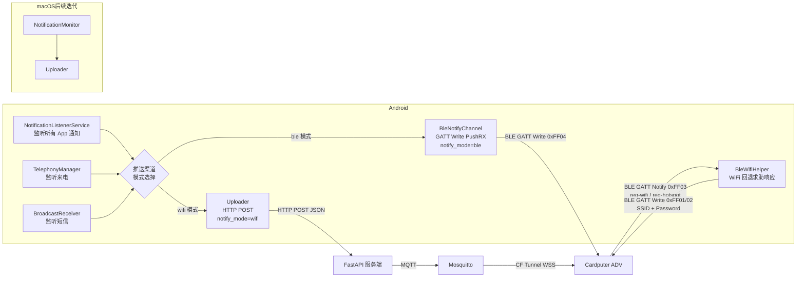
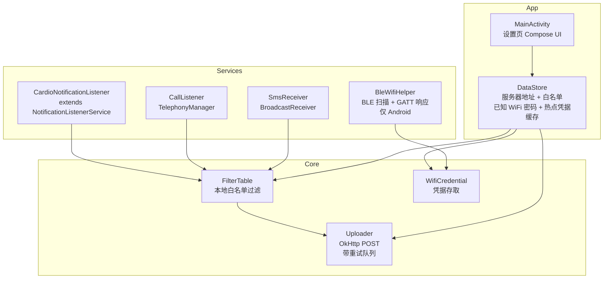
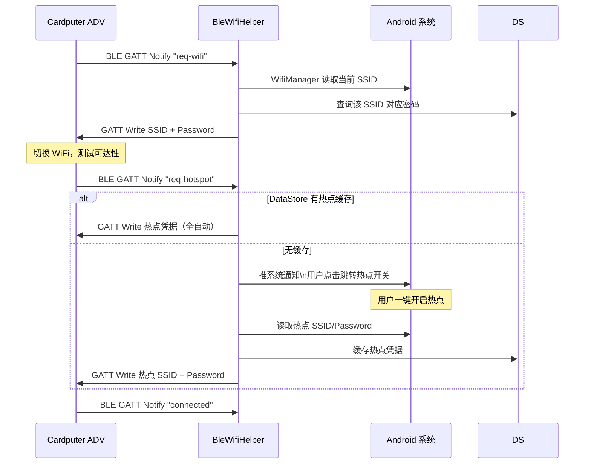
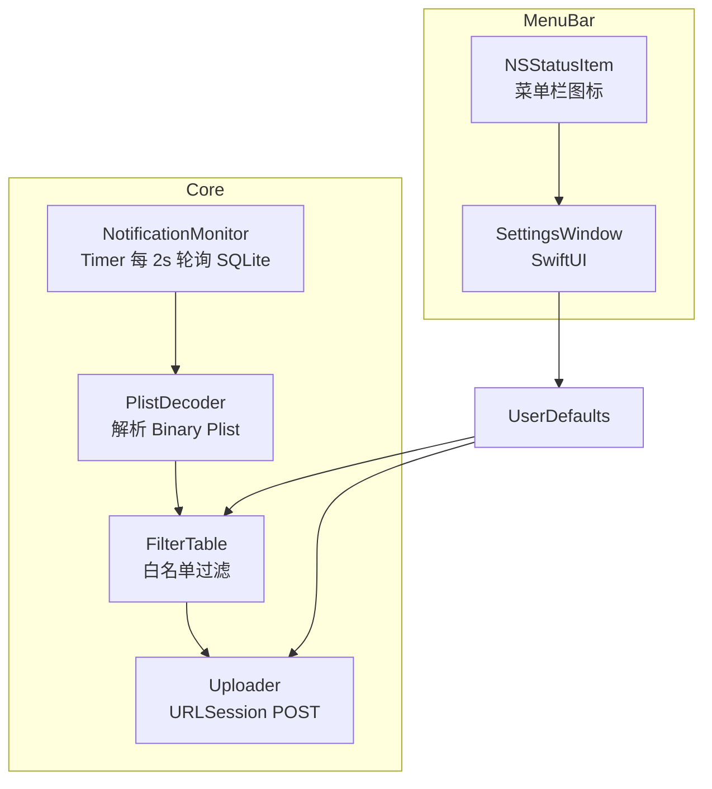
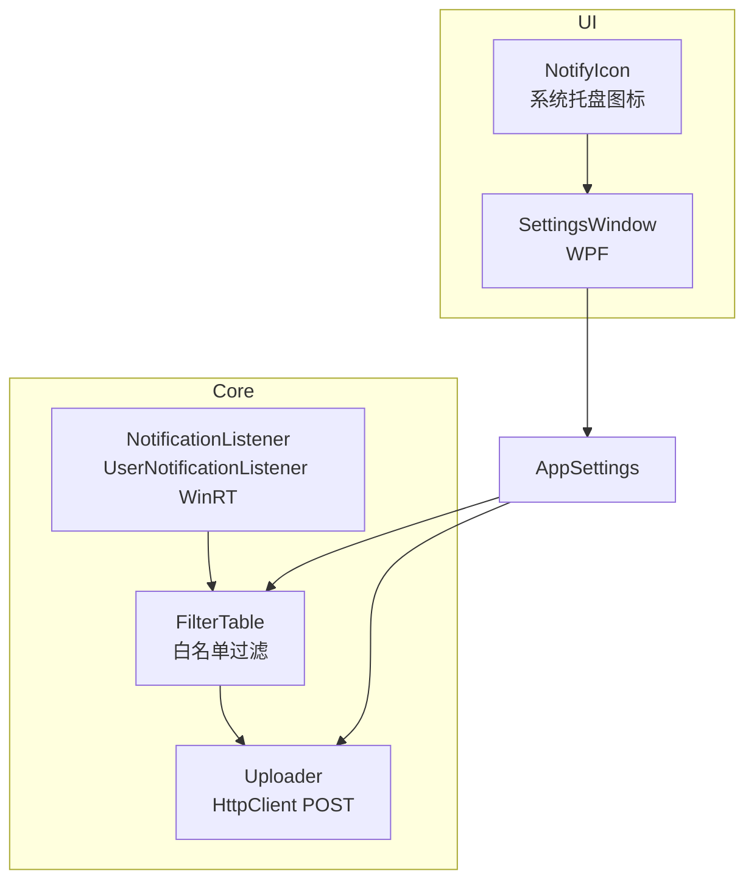

# Cardio — 客户端开发计划

## 总体原则

- 全部做成原生应用，无 Web、无需用户装额外依赖
- 常驻后台，系统托盘 / 菜单栏图标，不占前台
- 统一向 FastAPI 服务端发 HTTP POST，格式一致
- 本地维护一份白名单（与服务端 notify_filter.txt 同步），减少无效请求

---

## 架构总览



---

## 统一消息格式

```json
{
  "source": "微信",
  "content": "张三: 你在吗",
  "priority": "normal",
  "timestamp": 1748000000,
  "platform": "android"
}
```

来电固定格式：

```json
{
  "source": "来电",
  "content": "张三",
  "priority": "high",
  "timestamp": 1748000000,
  "platform": "android"
}
```

---

## Android 客户端

### 技术栈

| 项目 | 选择 |
|---|---|
| 语言 | Kotlin |
| UI | Jetpack Compose（设置页）+ 通知图标 |
| 后台服务 | NotificationListenerService（系统级） |
| 来电监听 | TelephonyManager.LISTEN_CALL_STATE |
| 短信监听 | BroadcastReceiver（SMS_RECEIVED） |
| HTTP | OkHttp（Android 内置，不需额外依赖） |
| 持久化 | DataStore（Jetpack，无第三方依赖） |
| 打包 | APK，侧载安装 |

### 所需系统权限

```xml
<uses-permission android:name="android.permission.BIND_NOTIFICATION_LISTENER_SERVICE"/>
<uses-permission android:name="android.permission.READ_PHONE_STATE"/>
<uses-permission android:name="android.permission.RECEIVE_SMS"/>
<uses-permission android:name="android.permission.INTERNET"/>
<uses-permission android:name="android.permission.FOREGROUND_SERVICE"/>
<uses-permission android:name="android.permission.BLUETOOTH_SCAN"/>
<uses-permission android:name="android.permission.BLUETOOTH_CONNECT"/>
<uses-permission android:name="android.permission.ACCESS_WIFI_STATE"/>
<uses-permission android:name="android.permission.ACCESS_FINE_LOCATION"/>
```

用户需在系统设置中手动授予通知访问权限（Settings → Notification Access）
都要在应用里做好指引或自动化，只需要用户点同意就行，或者跳转到对应设置页面

### 模块设计



### BleWifiHelper 工作流程



> **密码限制说明**：Android 不允许第三方 App 静默读取其他 WiFi 的密码。
> 用户需在设置页为每个常用 WiFi 手动填写一次密码，之后全自动。
> 热点凭据在首次开启后自动记录，后续无需任何操作。

### 模块代码量

| 文件 | 行数 |
|---|---|
| MainActivity.kt（设置 UI） | 130 |
| CardioNotificationListener.kt | 70 |
| CallListener.kt | 50 |
| SmsReceiver.kt | 40 |
| FilterTable.kt | 35 |
| NotifyChannel.kt（模式路由：BLE / WiFi） | 40 |
| Uploader.kt（HTTP POST，wifi 模式） | 100 |
| BleNotifyChannel.kt（GATT Write，ble 模式） | 120 |
| BleWifiHelper.kt（WiFi 回退响应，复用 BLE 连接） | 100 |
| WifiCredential.kt | 50 |
| DataStore 配置 | 30 |
| **合计** | **~765 行** |

### 任务清单

- [ ] 创建 Android Studio 项目，Kotlin + Compose
- [ ] 实现 `CardioNotificationListener`：过滤系统 UI 通知，提取来源和内容前 50 字
- [ ] 实现 `CallListener`：来电时立即上传，挂断不上传
- [ ] 实现 `SmsReceiver`：提取发件人 + 内容前 50 字
- [ ] `FilterTable`：本地 Map 过滤，默认白名单为空（全放行），可在设置里配置
- [ ] `Uploader`：POST 失败时放入内存队列，WiFi 恢复后重试（最多 20 条）
- [ ] `NotifyChannel`：根据设置中的 `notify_mode` 路由到 BleNotifyChannel 或 Uploader
- [ ] `BleNotifyChannel`（ble 模式）：连接 Cardio-XXXX，订阅 0xFF03/05，写 0xFF04 PushRX
- [ ] `BleWifiHelper`：复用 BleNotifyChannel 的已有 BLE 连接，监听 0xFF03 req-wifi / req-hotspot
- [ ] `WifiCredential`：DataStore 存取 SSID→密码映射，热点凭据缓存
- [ ] 设置页：notify_mode 三选一（BLE直连/WiFi/关闭）、服务器地址（WiFi模式）、白名单、WiFi 密码列表
- [ ] 热点流程：首次推通知 → 跳转设置 → 记录凭据；后续全自动
- [ ] 前台 Service 保活（Android 要求后台服务需前台通知）
- [ ] 打包 APK，测试侧载

---

## macOS 客户端（后续迭代）

### 技术栈

| 项目 | 选择 |
|---|---|
| 语言 | Swift |
| UI | SwiftUI（设置窗口）+ NSStatusItem（菜单栏图标） |
| 通知获取 | 读取 Notification Center SQLite 数据库 |
| 权限 | Full Disk Access（用户在系统设置中授予一次） |
| HTTP | URLSession（系统内置） |
| 持久化 | UserDefaults |
| 打包 | .app 包，拖入 Applications 即用 |

### 通知获取原理

macOS 将所有通知存入 SQLite 数据库：

```
~/Library/Application Support/NotificationCenter/db2/db
```

App 每 2 秒查询新记录：

```sql
SELECT app_id, data, delivered_date
FROM record
WHERE delivered_date > ?
ORDER BY delivered_date ASC
```

`data` 列是 Binary Plist，用 `PropertyListSerialization` 解码后得到通知标题和正文。

需要在系统设置中授予 **完全磁盘访问权限（Full Disk Access）**，这是 macOS 的标准合法权限，许多知名 App（如 CleanMyMac、Alfred）都使用。

### 模块设计



### 模块代码量

| 文件 | 行数 |
|---|---|
| AppDelegate.swift（菜单栏图标 + 生命周期） | 100 |
| NotificationMonitor.swift（SQLite 轮询） | 160 |
| PlistDecoder.swift（Binary Plist 解析） | 80 |
| FilterTable.swift | 60 |
| Uploader.swift | 80 |
| SettingsView.swift（SwiftUI） | 120 |
| **合计** | **~600 行** |

### 任务清单

- [ ] 创建 Xcode 项目，SwiftUI + AppKit，关闭 Sandbox（需要磁盘访问）
- [ ] `NSStatusItem` 菜单栏图标：图标 + 菜单（打开设置、启用/禁用、退出）
- [ ] `NotificationMonitor`：用 `SQLite3` C API 查询 db，记录上次 `delivered_date`
- [ ] `PlistDecoder`：用 `PropertyListSerialization` 解码 `data` 列，提取 `titl`/`body`
- [ ] `FilterTable`：从 UserDefaults 读取白名单，过滤 app_id
- [ ] `Uploader`：URLSession POST，失败时缓存到 UserDefaults 队列
- [ ] `SettingsView`：服务器地址、白名单（app bundle id 列表）、测试按钮
- [ ] 首次启动引导用户开启 Full Disk Access（打开系统设置对应页面）
- [ ] 登录启动项：`SMLoginItemSetEnabled` 或 LaunchAgent plist
- [ ] 打包 .app，测试

---

## Windows 客户端（后续迭代）

### 技术栈

| 项目 | 选择 |
|---|---|
| 语言 | C# |
| 框架 | .NET 8 + WPF |
| 通知获取 | WinRT `UserNotificationListener`（官方 API） |
| HTTP | `HttpClient`（.NET 内置） |
| 托盘图标 | `NotifyIcon`（WPF 内置） |
| 持久化 | `Properties.Settings`（.NET 内置） |
| 打包 | 单文件 self-contained .exe（无需安装 .NET Runtime） |

### 通知获取原理

Windows 10/11 提供官方 WinRT API：

```csharp
var listener = UserNotificationListener.Current;
await listener.RequestAccessAsync();  // 弹出权限请求对话框

// 订阅新通知事件
listener.NotificationChanged += OnNotificationChanged;
```

无需读数据库，API 直接推送事件，比 macOS 方案更干净。需要在 Windows 设置 → 通知 → 允许访问通知 中授权（系统弹框，一次性）。

### 模块设计



### 模块代码量

| 文件 | 行数 |
|---|---|
| App.xaml.cs（托盘图标 + 生命周期） | 100 |
| NotificationListener.cs（WinRT API） | 120 |
| FilterTable.cs | 60 |
| Uploader.cs（含重试） | 100 |
| SettingsWindow.xaml + .cs | 150 |
| **合计** | **~530 行** |

### 任务清单

- [ ] 创建 .NET 8 WPF 项目，添加 WinRT 引用（`Windows.UI.Notifications.Management`）
- [ ] `NotifyIcon` 系统托盘：图标、右键菜单（设置、启用/禁用、退出）
- [ ] `NotificationListener`：`RequestAccessAsync()` 申请权限，`NotificationChanged` 事件订阅
- [ ] 提取通知：`notification.GetContent()` → `ToastNotificationXml` → 解析 `<text>` 节点
- [ ] `FilterTable`：从 Settings 读白名单，按 AppUserModelId 过滤
- [ ] `Uploader`：`HttpClient` POST，失败时存内存队列，重试
- [ ] `SettingsWindow`：服务器地址、白名单（App 名称列表）、测试连接
- [ ] 开机自启：写注册表 `HKCU\Software\Microsoft\Windows\CurrentVersion\Run`
- [ ] 发布为 `dotnet publish -r win-x64 --self-contained -p:PublishSingleFile=true`
- [ ] 测试打包后的单 .exe 直接运行

---

## 代码量汇总

| 平台 | 语言 | 行数 | 状态 |
|---|---|---|---|
| Android | Kotlin | ~765 | 本期开发 |
| macOS | Swift | ~600 | 后续迭代 |
| Windows | C# | ~530 | 后续迭代 |
| **本期客户端** | | **~1030 行** | |

---

## 整体项目代码量

| 部分 | 行数 |
|---|---|
| 固件 C++ | ~2510 |
| 服务端 Python | ~170 |
| Android 客户端 Kotlin | ~765 |
| **总计** | **~3545 行** |

---

## 开发顺序建议

客户端开发集中在 Week 2 Day 1-4，详见 [PLAN.md](PLAN.md) 甘特图。

- **Android**：本期唯一客户端，功能最全（通知 + BleWifiHelper）
- **macOS / Windows**：设计文档已完成，后续迭代直接开工
