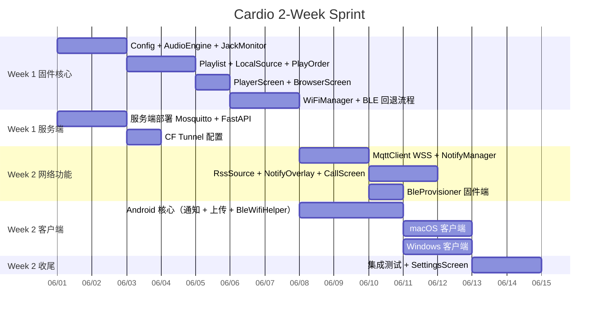

# Cardio — 开发计划

## 代码量估算

### 固件各模块

| 模块 | 文件 | 估算行数 | 说明 |
|---|---|---|---|
| 主入口 | Cardio.ino | 80 | setup/loop，模块初始化 |
| Config | Config.h/cpp | 120 | 读写 config.txt，键值对解析 |
| AudioEngine | AudioEngine.h/cpp | 150 | ESP32-audioI2S 封装，ES8311 寄存器配置，增益分级 |
| JackMonitor | JackMonitor.h/cpp | 60 | GPIO 中断，插拔事件回调 |
| PlaybackController | PlaybackController.h/cpp | 200 | 核心状态机，衔接音源/顺序/引擎 |
| Playlist + PlayOrder | Playlist.h/cpp | 180 | 列表数据结构，5 种顺序算法（含 Fisher-Yates shuffle） |
| LocalSource | LocalSource.h/cpp | 120 | 扫描 /Cardio/music/，构建文件夹列表 |
| RssSource | RssSource.h/cpp | 180 | HTTP 拉取，轻量 XML 解析（匹配 title/enclosure） |
| WiFiManager | WiFiManager.h/cpp | 80 | 连接、重连、状态回调 |
| MqttClient | MqttClient.h/cpp | 130 | WSS 连接，订阅 notify/#，心跳重连 |
| NotifyManager | NotifyManager.h/cpp | 160 | 状态机，白名单过滤，优先级路由 |
| PlayerScreen | PlayerScreen.h/cpp | 200 | 封面、歌名、进度条、状态图标 |
| BrowserScreen | BrowserScreen.h/cpp | 180 | 列表/文件夹/RSS 统一浏览，光标导航 |
| NotifyOverlay | NotifyOverlay.h/cpp | 80 | 顶部通知条，5s 计时淡出 |
| CallScreen | CallScreen.h/cpp | 100 | 全屏来电，来源/内容显示，关闭按键 |
| SettingsScreen | SettingsScreen.h/cpp | 150 | 运行时开关，写回 config.txt |
| **固件合计** | | **~2170 行** | |

### 服务端

| 模块 | 文件 | 估算行数 | 说明 |
|---|---|---|---|
| 通知转发 API | main.py | 120 | FastAPI，HTTP POST → MQTT publish，优先级过滤 |
| Mosquitto 配置 | mosquitto.conf | 20 | listener 1883/9001，auth |
| Docker Compose | docker-compose.yml | 30 | Mosquitto + FastAPI 服务 |
| **服务端合计** | | **~170 行** | |

### 客户端通知捕获

| 平台 | 文件 | 估算行数 |
|---|---|---|
| Mac | notify_capture.py | 80 |
| Windows | notify_capture.py | 80 |
| Android | tasker_profile.xml | — （Tasker 图形配置） |
| **客户端合计** | | **~160 行** | |

### 总计

| 部分 | 语言 | 行数 |
|---|---|---|
| 固件 | C++ | ~2200 |
| 服务端 | Python | ~170 |
| Android 客户端 | Kotlin | ~770 |
| macOS 客户端 | Swift | ~600 |
| Windows 客户端 | C# | ~530 |
| **总计** | | **~4270 行** |

> 客户端详细计划见 [CLIENT_PLAN.md](CLIENT_PLAN.md)

---

## 开发里程碑（2 周压缩版）

精致化功能（封面、EQ、NVS 续播、省电）移至后续迭代，2 周内交付可用版本。

---

## 任务清单

### Week 1 Day 1-2 — 固件基础层

- [ ] 分区方案设为 `huge_app.csv`（默认 1.4MB 放不下所有库，需改为 3MB App 分区）
- [ ] Config：解析 config.txt，读取所有开关和配置项，`mqtt_port` 默认 443
- [ ] AudioEngine：ES8311 I2S 引脚确认，48kHz/24-bit，关 ALC，增益分级，DMA buffer 调优
- [ ] JackMonitor：GPIO 边沿中断，插拔立即暂停
- [ ] 基础播放验收：SD 卡放 FLAC，Space/←/→/音量键能用，拔耳机暂停

### Week 1 Day 3-4 — 播放列表

- [ ] LocalSource：扫描 `/Cardio/music/` 一级子文件夹，散文件归入默认列表
- [ ] 支持格式：MP3 / FLAC / WAV / AAC / M4A / OGG / Opus（ESP32-audioI2S 全部内置，无需额外工作）
- [ ] Playlist + PlayOrder：5 种顺序，fn+O 切换
- [ ] BrowserScreen：↑↓ 移动，Enter 播放，长按 fn 进入列表选择
- [ ] PlayerScreen：歌名、艺术家（ID3 回调）、进度条、mm:ss

### Week 1 Day 5 — UI 收尾

- [ ] RssSource 列表与本地列表在 BrowserScreen 混合显示（图标区分 📁 / 📡）
- [ ] SettingsScreen 骨架（开关页，后续扩充）

### Week 1 Day 6-7 — 网络 + BLE 回退

- [ ] WiFiManager：连接 NVS 凭据 → 失败或服务不可达 → 触发 BLE 回退
- [ ] BleProvisioner：NimBLE GATT Server，广播 `cardio/req-wifi` / `cardio/req-hotspot`
- [ ] 服务端并行：docker-compose 部署 Mosquitto + FastAPI，CF Tunnel 配置

---

### Week 2 Day 1-2 — 固件网络功能

- [ ] MqttClient：WiFiClientSecure + WebSocketsClient + PubSubClient，WSS 连接
- [ ] NotifyManager：订阅 `notify/#`，JSON 解析，状态机（IDLE/NOTIFY/CALL）
- [ ] 白名单：从 `notify_filter.txt` 读取
- [ ] NotifyOverlay：顶部通知条，5s 自动消失，音乐继续
- [ ] CallScreen：全屏来电，音乐暂停，用户关闭后恢复

### Week 2 Day 1-3 — Android 客户端（可与固件并行）

- [ ] NotificationListenerService + CallListener + SmsReceiver
- [ ] FilterTable + Uploader（OkHttp，带重试）
- [ ] BleWifiHelper：扫描 GATT Notify，响应 req-wifi / req-hotspot
- [ ] WifiCredential：SSID→密码 DataStore，热点凭据缓存
- [ ] 设置页：权限引导（一键跳转各权限设置页）、服务地址、WiFi 密码列表

### Week 2 Day 4-5 — macOS + Windows 客户端

- [ ] macOS：NSStatusItem + SQLite 轮询 + Uploader + SettingsView + 登录启动
- [ ] Windows：NotifyIcon + UserNotificationListener + Uploader + SettingsWindow + 自启动

### Week 2 Day 6-7 — 集成测试 + RSS

- [ ] RssSource：HTTPClient 拉取 XML，解析 `<title>` / `<enclosure url=`
- [ ] WiFiManager + RssSource 联调（rss_enabled 控制）
- [ ] 全链路测试：手机通知 → FastAPI → MQTT → Cardputer 显示
- [ ] BLE 回退流程测试：断网 → req-wifi → req-hotspot → 恢复
- [ ] SettingsScreen：运行时切换开关，写回 config.txt

---

## 后续迭代（2 周后）

| 功能 | 工期估算 |
|---|---|
| 封面图（TJpgDec） | 2d |
| 硬件 EQ（ES8311 DSP 寄存器） | 1d |
| NVS 断电续播 | 1d |
| 省电息屏 + 低电警告 | 1d |
| 自定义开屏图片 | 1d |
| Splash Converter 工具 | 1d |
| iOS 客户端（如有需要） | 5d |

---

## 自定义开屏图片

### 固件端（SplashScreen.h/cpp，~50 行）

启动时检测 `/Cardio/splash.jpg`，存在则显示 2 秒（任意键跳过），不存在直接进主界面。使用 M5GFX 内置的 `drawJpgFile`，复用已有的 TJpgDec，零额外依赖。

### Splash Converter 工具（tools/splash-converter/index.html，单文件）

纯 HTML + Canvas，双击浏览器直接打开，无需安装任何东西。

**功能：**
- 拖拽 / 点击上传图片（JPG / PNG / WebP / GIF / BMP）
- 四种模式：自由裁剪 / 填满裁剪 / 信箱适配 / 拉伸填满
- 自由裁剪模式：鼠标拖拽画裁剪框，8 个控制点调整大小，可选锁定 16:9 比例
- 信箱适配：可选背景色（黑 / 白 / 深蓝 / 自定义）
- JPEG 质量滑块（10-100，默认 85）
- 实时预览（240×135 实际尺寸）
- 一键下载 `splash.jpg`，拷贝到 SD 卡 `/Cardio/splash.jpg` 即用

---

## 风险点

| 风险 | 可能性 | 应对 |
|---|---|---|
| ESP32-audioI2S 与 M5Cardputer 库 I2S 冲突 | 中 | Week 1 最先验证，必要时手动接管 ES8311 初始化 |
| ADV 的 ES8311 引脚文档不全 | 中 | 参考 AndyAiCardputer/cardputer-adv-tests 仓库的测试代码 |
| CF Tunnel WSS 延迟导致 MQTT 断线 | 低 | PubSubClient 设置 keepalive=60，断线自动重连 |
| RssSource XML 格式不规范 | 中 | 只匹配最小必要字段，容错处理 |
| PSRAM 不足导致音频 buffer 溢出 | 低 | ADV 有 8MB PSRAM，足够；监控堆使用 |
