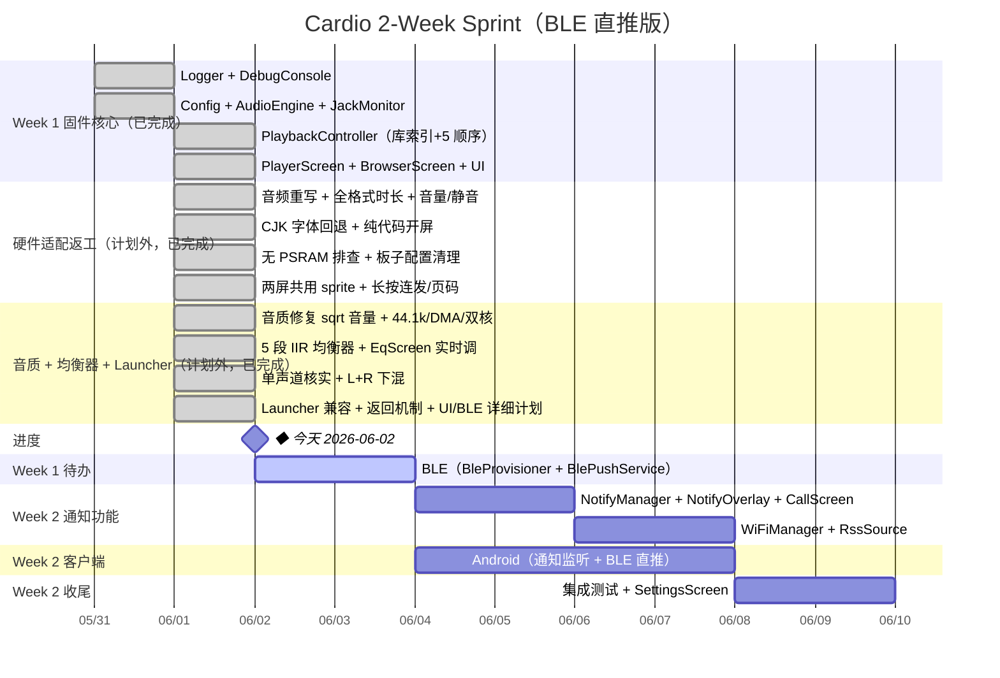

# Cardio — 开发计划

## 代码量估算

### 固件各模块

| 模块 | 文件 | 估算行数 | 说明 |
|---|---|---|---|
| 主入口 | Cardio.ino | 357 | setup/loop，三屏模式路由（Player/Browser/EQ），按键处理，返回 Launcher |
| Config | Config.h/cpp | 120 | 读写 config.txt，键值对解析 |
| Logger | Logger.h/cpp | 120 | 分级日志，输出到 Serial / BLE NUS / SD 卡文件 |
| DebugConsole | DebugConsole.h/cpp | 220 | 命令解析分发，Serial + BLE NUS 双通道 |
| AudioEngine | AudioEngine.h/cpp | 515 | ESP8266Audio 1.9.7 解码 + 精确时长 + sqrt 音量曲线 + 44.1k 原生输出 |
| AudioOutputM5Speaker | AudioOutputM5Speaker.h/cpp | 92 | 三缓冲零拷贝桥接 M5.Speaker + (L+R)/2 单声道下混；I2S 喂数任务 Core 0 |
| Equalizer | Equalizer.h/cpp | 207 | 5 段 peaking 双二阶 IIR 均衡器（RBJ + DF2T），实时调，全平旁路零开销 |
| JackMonitor | JackMonitor.h/cpp | 60 | JACK_PIN=-1 禁用检测（ADV 无硬件 jack-detect GPIO），框架就位 |
| PlaybackController | PlaybackController.h/cpp | 360 | 开机全量扫描 /Cardio/music/ → 内存库索引（相对路径）+ 5 种播放顺序（Fisher-Yates）+ 引擎衔接；已并入旧 LocalSource/Playlist |
| RssSource | RssSource.h/cpp | 180 | HTTP 拉取，轻量 XML 解析（匹配 title/enclosure） |
| WiFiManager | WiFiManager.h/cpp | 80 | 连接、重连、状态回调 |
| BlePushService | BlePushService.h/cpp | 100 | GATT PushRX Characteristic，notify_mode=ble 时接收手机直推 |
| MqttClient | MqttClient.h/cpp | 130 | WSS 连接，订阅 notify/#，心跳重连，notify_mode=wifi 时启用 |
| NotifyManager | NotifyManager.h/cpp | 160 | 状态机，白名单过滤，BLE/WiFi 两路输入统一路由 |
| PlayerScreen | PlayerScreen.h/cpp | 200 | 封面、歌名、进度条、状态图标 |
| BrowserScreen | BrowserScreen.h/cpp | 180 | 列表/文件夹/RSS 统一浏览，光标导航 |
| EqScreen | EqScreen.h/cpp | 138 | 均衡器界面，5 段竖向推子，方向键实时调 |
| NotifyOverlay | NotifyOverlay.h/cpp | 80 | 顶部通知条，5s 计时淡出 |
| CallScreen | CallScreen.h/cpp | 100 | 全屏来电，来源/内容显示，关闭按键 |
| SettingsScreen | SettingsScreen.h/cpp | 150 | 运行时开关，写回 config.txt |
| **固件合计** | | **~3490 行** | |

### Android 客户端（BLE 直推，本期）

| 模块 | 文件 | 估算行数 |
|---|---|---|
| 通知监听 + 来电/SMS | NotificationService.kt | 200 |
| BLE 直推（BlePusher） | BlePusher.kt | 150 |
| 过滤规则 + 设置页 | FilterTable + SettingsActivity | 200 |
| **客户端合计** | | **~550 行** |

### 总计（本期）

| 部分 | 语言 | 行数 |
|---|---|---|
| 固件 | C++ | ~3490 |
| Android 客户端（BLE 直推） | Kotlin | ~550 |
| **总计** | | **~4040 行** |

> 服务端（Mosquitto + FastAPI）、MQTT 路径、Android HTTP Uploader 移至后续迭代。
>
> macOS / Windows 客户端暂不开发，后续迭代再加。
>
> 客户端详细计划见 [CLIENT_PLAN.md](CLIENT_PLAN.md)（WiFi 路径部分为后续迭代参考）

---

## 开发里程碑（2 周压缩版）

精致化功能（封面、NVS 续播、省电）及服务端移至后续迭代，2 周内交付 BLE 直推可用版本。（均衡器原属后续迭代，已提前用**软件 DSP** 实现，见下。）



> 进度标记用固定日期的 **◆ 今天** 里程碑（不依赖渲染时钟，永远画在对的位置）；推进度时把它的日期往后改即可。截至 2026-06-02：Week 1 固件核心 4 项 + 计划外硬件返工 + 音质优化/均衡器 + **Launcher 兼容**全部完成，**下一步 UI 收尾 + BLE 直推**（条目标为 active，详细实施计划见 [PLAN_UI_BLE.md](PLAN_UI_BLE.md)）。

> **进度说明**（截至 2026-06-02）：Week 1 固件核心 4 项全部完成。期间因"8MB PSRAM"是错误假设（实为 ESP32-S3FN8 无 PSRAM），插入了一段计划外的硬件适配返工——音频层按 BrokenSignal 重写、MP3/WAV/FLAC 时长精确解析、CJK 逐字字体回退、开屏从 GIF 改纯代码、板子配置回退到 `m5stack-stamps3`、两屏共用一个 sprite 把可用堆从 ~150KB 提到 ~244KB。
>
> 随后又做了一轮**音质优化 + 均衡器**（计划外）：① 发现 M5.Speaker 把 master 音量**平方**使用，旧的线性砍音量等于把位深压没了 → 改 **sqrt 曲线** + 输出端配 **44.1k 原生 / DMA 512 / I2S 任务钉 core 0**；② 加了 **5 段 peaking IIR 软件均衡器**（`e` 键进 EqScreen 实时调，存 config `eq=`，全平时旁路零开销）；③ 核实 **ES8311 是单声道 codec**（耳机与喇叭共用单路输出，硬件无立体声），固件改 **(L+R)/2 下混**避免单声道 codec 只取左声道丢内容。三轮均已实机烧录验证、堆稳定。
>
> 接着做了 **bmorcelli Launcher 兼容**：新增 `cardputer-adv-launcher` 构建（`partitions_launcher.csv`，app 上限 1.31MB，当前 1.05MB 余 ~19%）+ `returnToLauncher()`（运行时找 TEST 分区设为启动重启，无 Launcher 时空操作，独立烧录安全）+ `` ` ``(Esc) 键 / `launcher` 控制台命令。**下一步：UI 收尾 + BLE 直推**——详细实施计划（每组件文件/接口/数据流/内存预算/顺序/测试）见 [PLAN_UI_BLE.md](PLAN_UI_BLE.md)，内存余量已为 BLE 备好。

---

## 任务清单

### Week 1 Day 1 — Logger + DebugConsole（最先做）

**原则：所有后续模块开发直接用 LOG_X 埋点，不再用 Serial.println**

- [x] `Logger`：全局单例，宏接口 `LOG_D/I/W/E(tag, fmt, ...)`
  - Serial 实时输出（USB CDC 115200）
  - SD 卡写入 `/Cardio/logs/cardio.log`，超 512KB 自动轮转（保留 3 个文件）
  - 日志格式：`[000123456][INFO ][AUDIO] Playing: 稻香.flac`
  - 运行时级别过滤，`debug_enabled=false` 时关闭 SD 写入仅保留 Serial
- [x] `DebugConsole`（Serial 通道）：主循环非阻塞轮询，启动时打印命令列表，命令注册表供后续模块扩充

> ⚠️ Day1 代码已 `pio run` 通过，实机烧录待设备接入。`Cardio.ino` 中 SD SPI 引脚为原版 Cardputer 占位值，Day2 需用 ADV 实机确认。

**此阶段可用命令（随模块增加逐步扩充）：**
```
heap          显示 SRAM 剩余（本板无 PSRAM）
log level <debug|info|warn|error>   设置日志级别
log dump      输出当前日志文件全部内容
log clear     清空日志文件
reboot        重启设备
```

---

### Week 1 Day 2-3 — 固件基础层

- [x] 分区方案设为 `huge_app.csv`（默认 1.4MB 放不下所有库，需改为 3MB App 分区）
- [x] Config：解析 config.txt，读取所有开关和配置项，`mqtt_port` 默认 443
- [x] AudioEngine：ES8311 I2S 由 M5.Speaker 封装，**44.1k 原生 + 单声道下混**（硬件单 DAC）+ sqrt 音量曲线，三缓冲零拷贝桥接，I2S 喂数任务 Core 0
- [x] JackMonitor：JACK_PIN=-1 禁用检测（ADV 无硬件 jack-detect GPIO），框架就位
- [x] 基础播放验收：SD 卡 MP3 播放成功，FLAC 待验证；耳机暂停已降级（无 GPIO）

**新增调试命令：**
```
play <路径>    volume <0-21>    pause/resume    status
jack           battery          config get/set
```

### Week 1 Day 3-4 — 播放列表

- [x] PlaybackController：开机全量扫描 `/Cardio/music/` 一级子文件夹（跳过 macOS `._` AppleDouble 文件），散文件归入默认列表；内存库索引，切文件夹不再扫 SD
- [x] 支持格式：MP3 / FLAC / WAV（ESP8266Audio 1.9.7 + M5.Speaker；AAC / Opus 待实机确认；OGG Vorbis / M4A 无解码器）——**时长均精确解析**（MP3 Xing/CBR、WAV fmt/data、FLAC STREAMINFO）
- [x] 5 种播放顺序（并入 PlaybackController），`r` 键切换
- [x] BrowserScreen：↑↓ 移动，Enter 播放选中曲目（非固定第一首）
- [x] PlayerScreen：歌名、艺术家（ID3 回调）、进度条、mm:ss；CJK 逐字字体回退；音量长按连发；MUTE 指示

### Week 1 Day 5 — UI 收尾

- [ ] RssSource 列表与本地列表在 BrowserScreen 混合显示（图标区分 📁 / 📡）
- [ ] SettingsScreen 骨架（开关页，后续扩充）
- [ ] PairingScreen：BLE 配对码显示（6 位数字，20×26px 方块，对应 BleProvisioner Day 6-7）
- [ ] NoticeScreen：无 SD / 离线全屏错误提示（icon + pixel 大字 + CJK 副文字 + 操作提示）

### Week 1 Day 6-7 — BLE 通知直推

- [ ] BleProvisioner：NimBLE GATT Server，Service 0xFF00，含 WiFi 配网（0xFF01/02）和 DevStatus（0xFF03）
- [ ] BlePushService：在 0xFF00 追加 PushRX（0xFF04）和 PushACK（0xFF05），`notify_mode=ble` 时接收手机直推
- [ ] BleProvisioner 追加 NUS Service（6E400001...）：DebugConsole BLE 通道接入

**新增调试命令：**
```
ble status    notify <来源> <内容>    call <姓名>
```

---

### Week 2 Day 1-2 — 通知显示层

- [ ] NotifyManager：JSON 解析，状态机（IDLE/NOTIFY/CALL），接收 BLE 输入（`notify_mode=ble`）
- [ ] 白名单：从 `notify_filter.txt` 读取
- [ ] NotifyOverlay：顶部通知条，5s 自动消失，音乐继续
- [ ] CallScreen：全屏来电，音乐暂停，用户关闭后恢复

**新增调试命令：**
```
notify <来源> <内容>    call <姓名>    ui <screen>    screen <on|off>
```

### Week 2 Day 2-4 — WiFiManager + RSS

- [ ] WiFiManager：连接 NVS 凭据，仅供 RssSource 使用（通知不走 WiFi）
- [ ] RssSource：HTTPClient 拉取 XML，解析 `<title>` / `<enclosure url=`（`rss_enabled=true` 时启用）
- [ ] RssSource 与 BrowserScreen 联调

**新增调试命令：**
```
wifi status/connect    rss refresh    rss list
```

### Week 2 Day 1-4 — Android 客户端（可与固件并行）

- [ ] NotificationListenerService + CallListener + SmsReceiver
- [ ] FilterTable（本地白名单过滤）
- [ ] BlePusher：扫描并连接设备 GATT，通过 PushRX Characteristic 直推通知
- [ ] 设置页：权限引导（通知访问权限）、设备配对、白名单管理

### Week 2 Day 5-7 — 集成测试 + SettingsScreen

- [ ] 全链路测试：手机通知 → BLE → Cardputer 显示
- [ ] 来电测试：CallScreen 全屏 + 音乐暂停恢复
- [ ] RSS 播放联调（需 WiFi）
- [ ] SettingsScreen：运行时切换开关，写回 config.txt

---

## 后续迭代（2 周后）

### 服务端 + WiFi 通知路径

| 功能 | 工期估算 |
|---|---|
| 服务端部署：Mosquitto + FastAPI | 2d |
| CF Tunnel 配置（WSS 443） | 1d |
| 固件 MqttClient（WSS + PubSubClient + WebSockets） | 2d |
| NotifyManager 追加 WiFi/MQTT 路径 | 1d |
| Android HTTP Uploader（OkHttp，替换 BLE 直推） | 1d |
| BleWifiHelper（req-wifi / req-hotspot 自动回退） | 2d |
| BLE 回退流程端到端测试 | 1d |

### 精致化 + 工具

| 功能 | 工期估算 |
|---|---|
| 封面图（TJpgDec） | 2d |
| 补画 8 个缺失图标（pause/prev/next/note/heart/phone/bell/list） | 0.5d |
| ~~硬件 EQ（ES8311 DSP 寄存器）~~ → 已用**软件 5 段 IIR 均衡器**提前实现（`audio/Equalizer.cpp` + `ui/EqScreen.cpp`，`e` 键实时调，✅ 完成） | — |
| 外接 WM8960 立体声 codec（EXT 排针，真立体声 + 耳放 + I2C 音量 + 插拔检测）→ 详细计划见 [PLAN_WM8960.md](PLAN_WM8960.md) | ~4d（可选硬件增强）|
| NVS 断电续播 | 1d |
| 省电息屏 + 低电警告 | 1d |
| ~~自定义开屏动画（GIF/JPG）~~ → 已改**纯代码绘制**开屏（`ui/SplashScreen.cpp`，✅ 完成） | — |
| Splash 动画工具 `tools/splash-animation/`（Remotion，渲染 240×135 GIF；当前固件未读取该 GIF，✅ 工具就绪） | — |
| macOS 客户端 | 3d |
| Windows 客户端 | 3d |
| iOS 客户端（如有需要） | 5d |
| Web 配置页面 | 待定 |

---

## Web 配置页面

ADV 连上 WiFi 后在屏幕显示本机 IP，用户在同一局域网浏览器访问即可配置。

**技术方案：**
- 固件端运行 `ESPAsyncWebServer`（轻量异步 HTTP 服务器，Arduino 库）
- 配置页面 HTML 内嵌进固件 Flash（PROGMEM），不占 SD 卡
- REST API：`GET /api/config` 读取当前配置，`POST /api/config` 写入并保存到 NVS
- 需要 WiFi 已连接，config.txt 中加开关 `webui_enabled=true`

**可配置项：** 待定

---

## 自定义开屏动画

### 固件端（SplashScreen.h/cpp，已实现）

> ✅ **当前实现：纯代码绘制**（无 SD 资源、无 GIF 解码）。白底 + 绿黄绿品牌斜条纹从右扫到左，揭示橙色 CARDIO（Orbitron 字体）+ 分隔线 + ZUENS2020，约 1.5s 后进 PlayerScreen。全程画在一个 63KB sprite 内。
>
> ⛔ **GIF 方案已推迟为可选**：本板**无 PSRAM**（仅 512KB SRAM），全屏 GIF 解码缓冲 + AnimatedGIF + 两个屏 sprite 同时存在会 OOM 反复重启（已实测）。下述 GIF 路径需 PSRAM 或大幅削减常驻内存才能启用。

**GIF 路径（可选，当前未启用）：**
- 库：`bitbank2/AnimatedGIF`（Apache-2.0）
- GIFDraw 回调写入全屏 Sprite，按帧延迟 `pushSprite(0,0)`
- GIF 调色板直接输出 RGB565（`GIF_PALETTE_RGB565_LE`），无需转换
- ⚠️ 原计划"buffer 分配到 PSRAM 约 60KB"在本板不可行（无 PSRAM）

**JPG 回退路径（静态图）：**
- M5GFX 内置 `drawJpgFile`，复用 TJpgDec，零额外依赖

**文件检测顺序：**
```
/Cardio/splash.gif  → 有：播放 GIF 动画（最多 5s / 5 次循环）
/Cardio/splash.jpg  → 有：显示静态图 2s
无文件             → 直接进 PlayerScreen
```

### Splash Converter 工具（tools/splash-converter/index.html，单文件）

纯 HTML + Canvas，双击浏览器直接打开，无需安装。

**功能：**
- 拖拽 / 点击上传输入文件（图片：JPG/PNG/WebP/BMP；视频/动图：GIF/APNG/WebP 动图/MP4 片段）
- 四种裁剪模式：自由裁剪 / 填满裁剪 / 信箱适配 / 拉伸填满
- 自由裁剪：鼠标拖拽画裁剪框，8 控制点，可选锁定 16:9 比例
- 信箱适配：可选背景色（黑 / 白 / 深蓝 / 自定义）
- **输出格式二选一：**
  - **GIF**：帧率滑块（5-25fps）、帧数上限、抖动选项（Floyd-Steinberg）、调色板优化；使用 `gif.js` 库编码
  - **JPEG**：质量滑块（10-100，默认 85）
- 实时预览（240×135 实际尺寸，2× 放大显示）
- 一键下载 `splash.gif` 或 `splash.jpg`，拷贝到 SD 卡 `/Cardio/` 即用

---

## 风险点

| 风险 | 可能性 | 应对 |
|---|---|---|
| ESP8266Audio 1.9.7 与 M5.Speaker 桥接 underrun | 中 | AudioOutput 适配类用三缓冲，参考 AndyAiCardputer 实现 |
| ADV 的 ES8311 引脚 / MCLK / Jack 检测文档不全 | 中 | 参考 AndyAiCardputer 仓库，MCLK 走内部时钟 |
| NimBLE 与 WiFi 共存时吞吐下降 | 低 | BLE 仅推通知（小包），WiFi 只用于 RSS；可接受 |
| BLE 连接距离 / 稳定性 | 中 | 本期 BLE 直推是主路径，手机需在 10m 内；丢包重试机制 |
| RssSource XML 格式不规范 | 中 | 只匹配最小必要字段，容错处理 |
| 内存不足（无 PSRAM，仅 512KB SRAM）| **高** | ADV 实为 ESP32-S3FN8，**无 PSRAM**；两屏已共用 1 个 sprite 省 63KB（开机~244KB 空闲）；勿加全屏 GIF / 第三个 sprite；解码器需连续 ~40KB 块，留意碎片化 |
| CF Tunnel WSS 延迟导致 MQTT 断线 | 低 | **后续迭代**才涉及；PubSubClient keepalive=60 |
