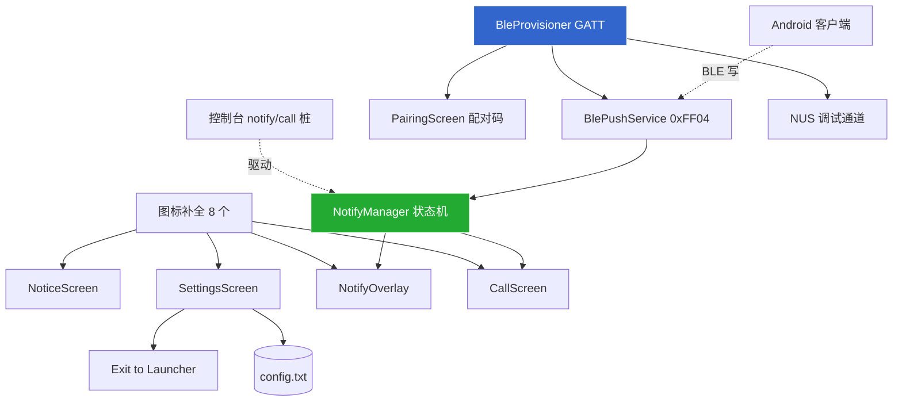
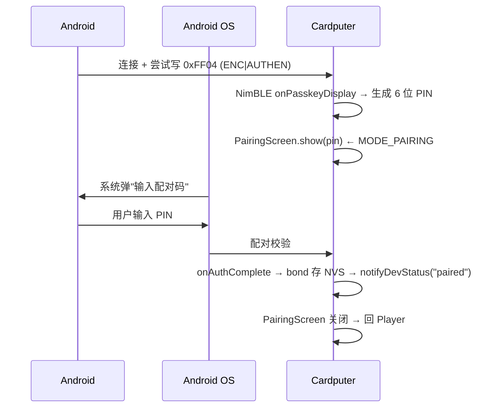
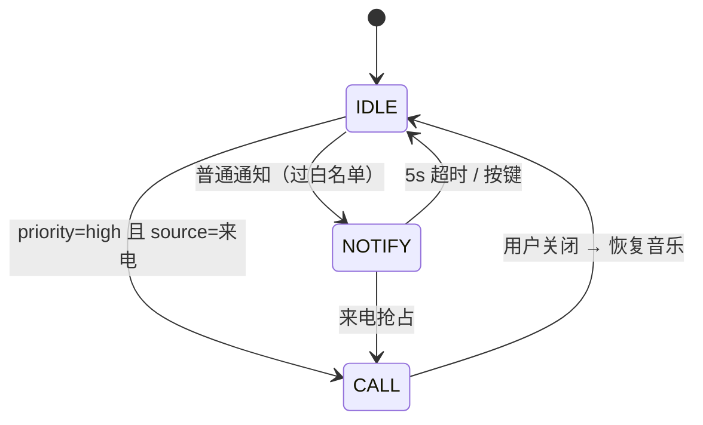

# Cardio — UI 收尾 & BLE 通知直推 详细实施计划

> 本文是 [PLAN.md](PLAN.md) 中"Week 1 Day 5 UI 收尾"和"Day 6-7 + Week 2 通知"两块的**详细设计展开**，
> 给出每个组件的文件、类接口、数据流、内存预算、实施顺序与测试方法。
> 架构总图见 [ARCHITECTURE.md](ARCHITECTURE.md)。

---

## 0. 现状与总体顺序

### 已完成（截至 2026-06-02）
- 屏幕：Player / Browser / EQ / Splash，全部共用 `theme::canvas()`（一块 240×135 sprite）
- 音频链路：解码 → Equalizer → (L+R)/2 单声道下混 → M5.Speaker
- 基础设施：Config / Logger / DebugConsole（Serial）/ PlaybackController / JackMonitor 框架
- Launcher 兼容：`returnToLauncher()` + `cardputer-adv-launcher` 构建

### 待做（本文范围）
```
UI 收尾：  图标补全 → NoticeScreen → SettingsScreen →（进度条局部刷新优化）
BLE 直推： NotifyManager → NotifyOverlay → CallScreen →（先用控制台驱动）
           → BleProvisioner + 配对 + PairingScreen → BlePushService → 接 NotifyManager
Android：  NotificationListener → BlePusher → 设置页
```

### 关键实施原则：**先用控制台桩驱动 UI，再接 BLE**
通知显示层（NotifyManager/Overlay/CallScreen）**不依赖 BLE**——先用现有 `notify <源> <内容>`、
`call <名>` 控制台命令驱动，把状态机和 UI 调通；BLE 只是后面接上去的一个输入源。
这样把"易错的 BLE/配对"和"纯 UI 逻辑"解耦，降低联调难度。

### 实施依赖图


---

## Part A — UI 收尾

### A1. 图标补全（8 个 16×16，最先做，零依赖）

**为什么先做**：NoticeScreen / SettingsScreen / Overlay / CallScreen 都要用，是公共底座。

**现状**：已有 24 个像素风 16×16 图标编译进固件（`fillRect` 数组，无需 SD）。

**待补 8 个**：`pause / prev / next / note / heart / phone / bell / list`

**实现**：
- 文件：`ui/Icons.h`（若已有就追加），每个图标 = `static const uint8_t ICON_PAUSE[16]`（每行 1 字节位图，16×16 用 16×uint16 或 1bpp）或沿用现有数组格式
- 绘制：`theme::drawIcon(spr, x, y, ICON_xxx, color)` 逐位 `drawPixel`/`fillRect`
- 验收：临时在 Player 角落画一排，串口 `ui icons` 命令预览

**工期**：0.5d

---

### A2. NoticeScreen（无 SD / 离线 / 空库 全屏提示）

**触发**：`mountSD()` 失败、音乐库为空、（后续）网络错误。

**当前缺口**：现在 SD 挂载失败只打日志，仍进 Player（显示空列表），体验差。

**设计**：
| 状态 | 图标 | 大字（像素风） | CJK 副文字 | 操作提示 |
|---|---|---|---|---|
| `NO_SD` | SD 卡图标 | "NO SD" | 插入 SD 卡 | 重启设备 |
| `EMPTY_LIB` | note | "EMPTY" | /Cardio/music/ 为空 | 拷入音乐后重启 |
| `OFFLINE`（后续） | wifi-off | "OFFLINE" | 网络不可达 | — |

**接口**：
```cpp
class NoticeScreen {
public:
    enum Kind { NO_SD, EMPTY_LIB, OFFLINE };
    static NoticeScreen& instance();
    void show(Kind k);          // 设状态 + 标脏
    void update();              // 脏则重绘（复用 canvas）
};
```

**接线**（`Cardio.ino`）：
```cpp
if (!sdOk) { NoticeScreen::instance().show(NoticeScreen::NO_SD); mode = MODE_NOTICE; }
else if (pc.totalTracks()==0 && pc.folderCount()==0) { ... EMPTY_LIB ... }
```
`MODE_NOTICE` 在 loop 里只重绘 + 等任意键重启（或返回）。

**工期**：0.5d

---

### A3. SettingsScreen（运行时设置 + Exit to Launcher 入口）

**为什么重要**：承载 Launcher 退出、EQ 入口、静音、播放顺序、通知开关、关于页——把分散在按键里的功能收进一个可发现的菜单。

**设计**：列表式，复用 Browser 的导航手感（`;/.` 上下，`Enter` 选/切，`` ` `` 返回 Player）。
每项是一种**控件类型**：

| 项 | 类型 | 行为 | 持久化 |
|---|---|---|---|
| Volume ceiling (gain) | slider 16–160 | 即时 `ae.setGainCeiling()` | config `gain`（需新增键）|
| Mute on boot | toggle | `cfg.set("mute",...)` | config `mute` |
| Equalizer | action→屏 | 进 `EqScreen` | （EQ 自己存）|
| Playback order | cycle | `pc.cycleOrder()` | config `default_order` |
| Notify mode | cycle off/ble | `cfg.set("notify_mode")` | config |
| Log level | cycle | `Logger::setLevel` | config `log_level` |
| **Exit to Launcher** | action | `returnToLauncher()` | — |
| About | action→子页 | 版本/堆/电量/MAC | — |

**接口**：
```cpp
class SettingsScreen {
public:
    static SettingsScreen& instance();
    void open();
    void update();
    void onKey(char c, bool enter, bool esc);   // 导航 + 触发
private:
    struct Item { const char* label; uint8_t type; /* getter/setter 函数指针或 enum id */ };
    int _sel;
};
```
**实现要点**：
- `MODE_SETTINGS`；改动**即时 apply**（音量/EQ 立刻听到），退出时 `cfg.save()` 落盘一次
- 控件渲染：toggle 画 ◉/◯，slider 画小条，action 画 ›，cycle 画当前值
- 入口：Player 按 `s`（或 `Tab`/`Fn`+某键）；本文建议 `s`（当前空闲）

**工期**：1.5d

---

### A4. 进度条局部刷新（优化项，可选）

**现状**：Player 每秒全屏重绘整块 canvas 推屏（CLAUDE.md 已记）。
**优化**：进度条单独一块 `~232×8` 小 sprite，只 `pushSprite` 进度条区域。
**权衡**：省 SPI 带宽/CPU（播放时每秒少推一次全屏），但多一块 ~4KB sprite。
内存现在够（余 ~170KB），可做；但**优先级低**，BLE 之后再做。

**工期**：0.5d（可延后）

---

## Part B — BLE 通知直推

### B0. 内存预算（**最高风险，先评估再动手**）

| 项 | 占用 | 说明 |
|---|---|---|
| 启动后空闲堆 | ~205 KB | 实测 |
| 播放时空闲堆 | ~170 KB | 解码器 + 共享 sprite 已计入 |
| NimBLE 协议栈 + 1 连接 | ~40–55 KB | GATT server + 1 central |
| ArduinoJson 文档 | 栈上 ~1–2 KB | `StaticJsonDocument<512>`，不上堆 |
| **播放 + BLE 同时** | **预计余 ~110–130 KB** | **需实机实测确认不 OOM** |

**缓解措施**（NimBLE 裁剪，写进 `sdkconfig` / build_flags）：
- `CONFIG_BT_NIMBLE_MAX_CONNECTIONS=1`（只连 1 部手机）
- `CONFIG_BT_NIMBLE_MAX_BONDS=2` / `MAX_CCCDS` 适度
- MTU 默认即可（通知 JSON < 256B）
- 关闭不用的 NimBLE 角色（不做 central scan，只做 peripheral）
- **监控**：BLE begin 后立刻 `LOG_I heap`；播放中开 BLE 再测一次

**回退**：若播放 + BLE 同时 OOM → 收到 push 时若正在解码且堆紧张，短暂降级（如暂停解码 50ms 让出内存窗口）。先实测，不过早优化。

---

### B1. 依赖与配置

**platformio.ini**：
```ini
lib_deps =
    ...
    h2zero/NimBLE-Arduino
    bblanchon/ArduinoJson
build_flags =
    ...
    -D CONFIG_BT_NIMBLE_MAX_CONNECTIONS=1
```
**config.txt**：`notify_mode=ble`（已支持解析）；`notify_filter.txt` 白名单。

---

### B2. GATT 服务布局（已定，见 ARCHITECTURE.md，此处为实现锚点）

```
Service 0xFF00（Cardio Main）
  0xFF01 SSID      WRITE              （WiFi 配网，后续迭代用）
  0xFF02 Password  WRITE|ENC          （加密）
  0xFF03 DevStatus NOTIFY             设备→手机："req-wifi"/"connected"/"paired"…
  0xFF04 PushRX    WRITE|ENC|AUTHEN   手机→设备：通知 JSON（**本期核心**）
  0xFF05 PushACK   NOTIFY             设备→手机："ok"/"busy"
Service 6E400001（NUS，debug_ble=true）
  6E400002 RX WRITE / 6E400003 TX NOTIFY   调试通道
```

---

### B3. BleProvisioner（GATT Server 骨架 + 广播 + 安全）

**文件**：`net/BleProvisioner.h/cpp`（已在目录规划中）

**职责**：起 NimBLE、建 0xFF00 服务与特性、广播 `Cardio-XXXX`（XXXX=MAC 后 4 位 hex）、
管理配对/bond、提供 `notifyDevStatus(const char*)` 帮助函数。

**接口**：
```cpp
class BleProvisioner {
public:
    static BleProvisioner& instance();
    void begin();                                  // 起 NimBLE + service + 广播
    void notifyDevStatus(const char* s);           // 推 0xFF03
    void setPushHandler(std::function<bool(const char* json, size_t)> cb); // PushRX→NotifyManager
    bool isConnected() const;
    void unpairAll();                              // 清 bond
    void registerConsole();                        // ble status / ble unpair
};
```

**安全**：`NimBLEDevice::setSecurityAuth(BLE_SM_PAIR_AUTHREQ_BOND | _MITM | _SC)`，
PushRX 特性设 `ENC|AUTHEN`；首次写触发配对（见 B4）。

**工期**：1.5d

---

### B4. 配对流程（Passkey Entry + PairingScreen 联动）



**PairingScreen**（屏，A 部分补充）：
```cpp
class PairingScreen {  // 全屏，大号 6 位 PIN（Orbitron/Silkscreen）+ "在手机输入配对码"
    static PairingScreen& instance();
    void show(uint32_t pin);   // MODE_PAIRING
    void close();
    void update();
};
```
NimBLE 回调 `onPasskeyDisplay(pin)` → `PairingScreen::show(pin)`；`onAuthenticationComplete` → `close()`。

**工期**：1d（含 PairingScreen）

---

### B5. BlePushService（在 0xFF00 加 PushRX/PushACK，接 NotifyManager）

**职责**：PushRX `onWrite` → 取 JSON → 交 `NotifyManager::ingest(json)` → 据返回值
notify PushACK `"ok"`（已显示）/`"busy"`（如正在来电）。

**流控**：NotifyManager 忙（CALL 中）→ 回 `"busy"`，手机可重试。

> 实现上 B3/B5 可合并在 BleProvisioner 里（PushRX 是 0xFF00 的一个特性），
> 用 `setPushHandler` 把回调指向 NotifyManager，保持解耦。

**工期**：0.5d

---

### B6. NotifyManager（状态机 + JSON + 白名单）

**文件**：`notify/NotifyManager.h/cpp`

**状态机**：


**接口**：
```cpp
class NotifyManager {
public:
    static NotifyManager& instance();
    void begin();                          // 载入 notify_filter.txt 白名单
    bool ingest(const char* json, size_t); // 解析+路由；返回 false=busy
    void update();                         // 跑超时计时；loop 调用
    void registerConsole();                // notify <源> <内容> / call <名>（桩）
};
```

**JSON**（ArduinoJson `StaticJsonDocument<512>`）：`{source, content, priority, timestamp}`。

**白名单**（`notify_filter.txt`，`应用名=show|drop`）：未列出默认 show（或 drop，配置项定）。

**路由**：`priority=="high" && source=="来电"` → CALL；否则查白名单 → NOTIFY 或丢弃。

**输入源抽象**：`ingest()` 同时被 BlePushService（本期）和 MqttClient（后续）调用——
NotifyManager 不关心来源，便于后续加 WiFi 路径。

**工期**：1.5d

---

### B7. NotifyOverlay（顶部通知条，音乐继续）

**设计**：顶部 ~40px 横幅，图标（按 source 选 bell/phone/note）+ 标题 + 内容单行；
5s 计时淡出；按任意键立即消。**音乐不停**。

**渲染选择**（二选一，权衡内存）：
- **A. 复用 canvas 顶部区**：在 Player 重绘时叠加横幅区域——零额外内存，但与 Player 刷新耦合
- **B. 独立 ~240×40 sprite**：~19KB，解耦但吃内存（BLE 已紧张）→ **本期选 A**

**队列**：多条通知排队，逐条 5s 轮显（`std::queue<Notif>`，长度上限 8 防洪水）。

**工期**：1d

---

### B8. CallScreen（全屏来电，音乐暂停）

**设计**：全屏，phone 图标 + 来源/号码（大字）+ "按 Enter 关闭"；
进入时 `ae.pause()`，关闭时 `ae.resume()`（若关闭前在播放）。
来电会**抢占** NOTIFY/Player（MODE_CALL）。

**接口**：
```cpp
class CallScreen { static CallScreen& instance(); void show(const char* who); void close(); void update(); };
```

**工期**：1d

---

### B9. NUS 调试通道（debug_ble=true）

在 BleProvisioner 里追加 NUS Service（6E400001…），把 RX 写入喂给 `DebugConsole`，
TX notify 输出日志/命令结果——让没接 USB 时也能用 nRF Connect 发命令。

**工期**：0.5d

---

### B10. 测试策略（分层，先桩后真）

1. **纯 UI/状态机**（无 BLE）：
   - `notify 微信 在吗` → 顶部 Overlay 出现，5s 消失，音乐继续
   - `call 张三` → CallScreen 全屏，音乐暂停，Enter 关闭后恢复
   - 连发多条 → 队列轮显；CALL 抢占 NOTIFY
2. **BLE 链路**（nRF Connect 当手机）：
   - 扫到 `Cardio-XXXX` → 连接 → 写 0xFF04 触发配对 → PairingScreen 显 PIN → 输入 → "paired"
   - 写 0xFF04 通知 JSON → 设备显示 + 回 PushACK "ok"
   - 堆监控：`heap` 命令，BLE+播放同时不低于安全线
3. **Android 端到端**：真机通知 → BlePusher → Cardputer 显示

---

### B11. Android 客户端（可与固件并行）

**文件**（Kotlin，见 [CLIENT_PLAN.md](CLIENT_PLAN.md)）：
- `NotificationListenerService`：抓系统通知（需用户授"通知访问"权限）
- `CallListener`（`PhoneStateListener`）+ `SmsReceiver`：来电/短信
- `FilterTable`：本地白名单（与设备端 notify_filter 二选一或叠加）
- `BlePusher`：扫描 `Cardio-XXXX` → 连 GATT 0xFF00 → 配对 → 写 0xFF04 → 读 0xFF05 ACK
- 设置页：权限引导、设备配对、白名单管理

**通知 JSON**：`{"source":"微信","content":"张三: 在吗","priority":"normal","timestamp":...}`
来电固定 `priority=high, source=来电`。

**工期**：4d

---

## 工期汇总与里程碑建议

| 阶段 | 内容 | 工期 |
|---|---|---|
| UI-1 | 图标 + NoticeScreen | 1d |
| UI-2 | SettingsScreen（含 Exit to Launcher） | 1.5d |
| N-1 | NotifyManager + 控制台桩 | 1.5d |
| N-2 | NotifyOverlay + CallScreen | 2d |
| BLE-1 | BleProvisioner + 广播 + 安全 | 1.5d |
| BLE-2 | 配对 + PairingScreen | 1d |
| BLE-3 | BlePushService → 接 NotifyManager + NUS | 1d |
| AND | Android 客户端（并行） | 4d |
| INT | 端到端联调 + 进度条优化 | 1.5d |

**关键路径**：UI-1 → N-1 → N-2 →（BLE-1 → BLE-2 → BLE-3）→ INT，约 **9–10 个工作日**；
Android 并行不占关键路径。

## 风险登记

| 风险 | 等级 | 缓解 |
|---|---|---|
| BLE + 播放同时 OOM（无 PSRAM，仅 512KB） | **高** | NimBLE 裁剪到 1 连接；BLE begin 后立即测堆；Overlay 复用 canvas 不开新 sprite；必要时收到 push 时让出解码窗口 |
| 配对在不同 Android 版本上不稳 | 中 | Passkey Entry 标准流程；App 端提供"重新配对"（`removeBond` 反射）|
| 通知洪水冲垮显示/内存 | 中 | NotifyManager 队列上限 8 + 节流；忙时回 busy |
| `` ` `` 退出键在 ADV 键盘不上报 | 低 | 已确认 M5Cardputer 键映射含 `` ` ``；另有控制台 `launcher` 命令兜底；SettingsScreen 也有入口 |
| TCA8418 键盘在 BLE 活跃时 I2C 轮询受影响 | 低 | 键盘 I2C 与 BLE 不同总线；实测确认 |
