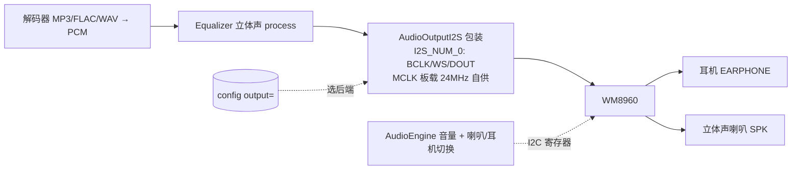

# Cardio — 外接 WM8960 立体声 Codec 实施计划

> **目标**：通过背后 **EXT 2.54-14P 排针**外接 Waveshare WM8960 Audio Board，拿到
> **真·立体声 + 耳放 + I2C 硬件音量 + 喇叭/耳机软切换**（这块板无插孔检测，故手动切换）。
>
> **设计原则**：可选、配置切换（`output=internal|wm8960`）。不接模块时默认走内部 ES8311
> 单声道，固件照常工作；接了模块并改配置才启用外部立体声路径。两条路径共存、互不破坏。
>
> 背景见 [ARCHITECTURE.md](ARCHITECTURE.md) 音频章、[CLAUDE.md](../CLAUDE.md) 音频约束。

---

## 0. 为什么 + 总览

- 内部 **ES8311 是单 DAC 单声道**（+ NS4150B 单声道功放 + 1 喇叭，耳机口共用这一路），
  硬件焊死，任何固件变不出立体声（详见 ARCHITECTURE）。
- **WM8960** = 立体声 codec：DAC **98dB**（超 CD 96dB）+ 耳放 **40mW@16Ω** + Class-D 喇叭
  **1W/ch@8Ω** + **I2C 控制**。彻底解决"耳机弱"(①) 和"数字音量掉位深"(②)。
- ⚠️ **插拔自动切换(③)在 Waveshare 这块板上不免费**：WM8960 芯片支持 jack-detect(GPIO1)，
  但 **Waveshare WM8960 Audio Board 没把 3.5 座的开关触点接到 GPIO1**（官方 wiki / GitHub issue #9
  已确认），所以喇叭↔耳机改用**软件手动切换**（I2C 切使能，一个键/菜单项）；要"插耳机自动停喇叭"
  需另加带开关的 3.5 座到空闲 GPIO（见 §2.6）。
- ESP32-S3 有两个 I2S：内部 ES8311 占 **I2S_NUM_1**，外接 WM8960 用空闲的 **I2S_NUM_0**；
  I2C 走共享总线（键盘/IMU 在 0x34/0x18，WM8960 在 **0x1A**，不冲突）。按配置二选一，不双开。

**数据流（output=wm8960）：**

对比当前 internal 路径：解码 → Equalizer **(L+R)/2 单声道** → AudioOutputM5Speaker → ES8311。

---

## 1. 硬件接线（EXT 排针）

> 以下据 **官方原理图实测**（`WM8960_Audio_Board_Schematic.pdf`）。

✅ **关键好消息：板上有 24MHz 有源晶振（XTAL1，EN 常开，OUT→I2S_MCLK），自给 WM8960 MCLK，
所以 ESP32 _不需要_ 输出 MCLK** —— I2S 只要 **3 根**（BCLK/LRCK/DACDAT），和 PCM5102A 一样。

主接口是 **P2（Header 8X2，16 针）**；放音从这几针接（每个信号在两列都有，任选一边）：

| P2 针 | 信号 | 接到 Cardputer | 说明 |
|---|---|---|---|
| 1 / 2 | VCC_3V3 | EXT **3V3** | ⚠️ **只接 3.3V，别接 5V**：板上是 VCC_3V3，晶振+codec 最高 3.6V，5V 会烧 |
| 4 / 15 | GND | EXT GND | |
| **3** | I2C_SDA | **G8** | 与键盘/IMU 共总线，WM8960@0x1A 不冲突 |
| **5** | I2C_SCL | **G9** | |
| **7**（或 10）| I2S_CLK（BCLK）| 空闲 GPIO | 位时钟 |
| **9**（或 12）| I2S_LRCLK | 空闲 GPIO | 帧时钟 |
| **11** | I2S_DAC（DACDAT）| 空闲 GPIO | 放音数据 ESP→WM8960 |
| — | MCLK | **不接** | 板载 24MHz 有源晶振自供（这是它能用在树莓派上的原因）|
| 14 | I2S_ADC | 录音才接 | 本期不用 |

另外 **P1（Header 3）= MCLK_TX / I2S_MCLK / MCLK_RX**（就是你看到的 TX/MCLK/RX 三个焊盘，
全是 MCLK 相关，自供 MCLK 时**用不到**）。耳机插板上 **EARPHONE** 口；喇叭接 **SPK**（白色 JST，LP/LN/RP/RN）。

> ⚠️ 信号 GPIO 从 EXT 的 G4/G5/G6/G13/G15 里挑 3 个（**避开 G3** strapping），以 EXT 丝印为准；
> ESP32-S3 GPIO 矩阵可任意映射。喇叭功放供电也在 VCC_3V3（3.3V → 约 0.4W，本板无法单独喂 5V）。

---

## 2. 软件架构

### 2.1 输出后端抽象（核心改动）
`AudioEngine::begin()` 按 `cfg.output()` 选后端，**解码链不变**（`AudioFileSourceSD →
AudioGeneratorXXX → out`），只换最后的 `out`：

| output= | 后端类 | 行为 |
|---|---|---|
| `internal`（默认）| `AudioOutputM5Speaker` | ES8311 单声道，sqrt 音量曲线，(L+R)/2 下混（现状）|
| `wm8960` | `AudioOutputWM8960I2S`（新）| WM8960 立体声，I2C 硬件音量，**不下混** |

### 2.2 I2S 输出（直接用 ESP8266Audio `AudioOutputI2S`）
- 板子自供 MCLK（24MHz 晶振），ESP32 只需作 I2S **master** 输出 BCLK/LRCK/DOUT、**无需 MCLK 引脚**
  → **直接用 ESP8266Audio 现成的 `AudioOutputI2S`**（`SetPinout(bclk, lrck, dout)`，端口 I2S_NUM_0）。
  原计划最大的不确定性（自写 IDF i2s_std 配 MCLK）**就此砍掉**。
- 立体声 EQ：薄薄包一层 `AudioOutput` 子类，`ConsumeSample(s[2])` 里先 `Equalizer::process(s)`
  （**立体声，L/R 各自滤波，不下混**）再转调内部的 `AudioOutputI2S`（或直接 `i2s_write`）。改动很小。
- `SetRate(hz)`：转调 AudioOutputI2S 的 SetRate + 写 WM8960 采样率/ PLL 寄存器（见 2.3）。
- WM8960 作 I2S **slave**：用板载 24MHz 作 SYSCLK + 内部 PLL 锁到 BCLK/LRCK 的采样率（I2C 配）。

### 2.3 WM8960 I2C 驱动（audio/WM8960.h/cpp）
- **移植 SparkFun WM8960 Arduino 库**（纯 I2C，用现有 `Wire` / G8-G9），或抽最小初始化序列
- 初始化寄存器序列（要点）：
  1. R15 复位
  2. 电源：R25/R26/R47 → 使能 VREF、DACL/R、LOUT1/ROUT1(耳放)、SPKL/R(喇叭)
  3. 时钟：**MCLK = 板载 24MHz** → 开 **PLL**（R52-R57）把 24MHz 倍频到目标采样率所需 SYSCLK，
     R4 选 SYSCLK=PLL 输出、R8 设分频（如 44.1k/48k）。SparkFun/Waveshare 驱动有现成时钟表
  4. 接口：R7 → I2S 格式、16-bit、**slave**
  5. R5 DAC 取消静音；R10/R11 DAC 音量
  6. 输出 mixer：R34/R37 把 DAC 路由到耳机 + 喇叭
  7. 耳机音量 R2/R3（LOUT1/ROUT1）
  8. Class-D 喇叭：R40 使能、R51 音量
  9. 喇叭/耳机使能由软件切（本板无插孔检测，见 §2.6）——按需 enable LOUT1/ROUT1 与/或 SPK
  10. 防 pop 上电时序
- 库方法对应：`enableDAC / enableHeadphones / setHeadphoneVolume / enableSpeakers /
  setSpeakerVolume / enableJackDetect …`

### 2.4 音量（无位深损失，解决痛点②）
- **wm8960 路径**：`setVolume(0-21)` → 映射到 WM8960 **耳机/喇叭音量寄存器**（模拟域 dB 步进），
  **I2S 数据流保持满幅** → 0 位深损失。`gain` 上限概念 → 映射 WM8960 最大音量。
- internal 路径：沿用现有 sqrt 曲线（M5.Speaker 平方补偿）。
- 对外 `AudioEngine::setVolume()` API 不变，内部按当前后端分派。

### 2.5 立体声 EQ 回切（解决痛点：声道分离）
- wm8960 用 `Equalizer` **现成的 `process(int16_t s[2])`**（L/R 各自滤波，已实现），**不做下混**。
- `(L+R)/2 下混` 只保留在 `AudioOutputM5Speaker` 路径里——按后端天然分流，无需开关。

### 2.6 喇叭/耳机切换（痛点③，Waveshare 板需手动）
> Waveshare WM8960 Audio Board **未把耳机座开关接到 WM8960 GPIO1**（官方确认），所以拿不到自动检测。

- **方案 A（默认，推荐，零额外硬件）**：**软件手动切换**。SettingsScreen 加一项 / 或一个键，
  I2C 切 WM8960 的喇叭使能(R26 SPK) 与耳机使能(R26 LOUT1/ROUT1) → 喇叭 / 耳机 / 两者。简单可靠。
- **方案 B（要自动，需加硬件）**：自备一个**带开关触点的 3.5 座**，检测脚接 ESP32 空闲 GPIO，
  → **复用现有 `JackMonitor`**（把 `JACK_PIN` 设成该脚，`onInsert`→切耳机静音喇叭、`onRemove`→切回），
  上层 pause/resume 钩子不变。注意：Waveshare 板载那个耳机座的开关没引出，得用你自己接的座。
- 不改 WM8960 芯片能力——切换只是使能哪路输出，HP 放大/音量仍由 codec 负责。

### 2.7 配置
- 新增 `Config` 键 **`output=internal|wm8960`**（默认 `internal`）。
- EXT 引脚定义放头文件常量（如 `audio/WM8960Pins.h`），带注释，便于按实际接线改。

---

## 3. 内存

- WM8960 I2C 驱动 ~几 KB；`AudioOutputWM8960I2S` 三缓冲 + I2S DMA ≈ 与 `AudioOutputM5Speaker` 相当。
- 同一时刻**只一个后端激活**（ES8311/I2S1 或 WM8960/I2S0），不双开 DMA。
- 整体影响小；与 BLE 共存仍按 [PLAN_UI_BLE.md](PLAN_UI_BLE.md) 的预算（开 BLE 后实测堆）。

---

## 4. 实施顺序

1. **硬件接线 + 上电自检**：I2C 扫描应能看到 **0x1A**
2. **WM8960 I2C 驱动**：复位 + 读寄存器 + 最小初始化，先用 IDF i2s 直接喂出 **1kHz 测试音**
3. **AudioOutputWM8960I2S**：接上 ESP8266Audio，放裸 PCM / WAV，**立体声**出耳机
4. **AudioEngine 后端切换**（`output=`）+ 立体声 EQ 路径 + I2C 音量映射
5. **喇叭/耳机手动切换**（I2C 切使能；方案 B 则接 GPIO + JackMonitor）
6. **双后端切换联调** + A/B（internal 单声道 ↔ wm8960 立体声）

---

## 5. 测试

- I2C 扫描确认 0x1A；写后读回寄存器校验
- **硬左右声道分离测试**：用硬 pan（一边乐器）音源 → 确认 L/R 真分开 ← **验证最初诉求**
- MP3/FLAC 立体声出耳机；与内部单声道 A/B
- 音量步进无 zipper 噪；低音量位深 OK
- 喇叭/耳机**手动切换**（键/菜单 → I2C 切使能）生效；若选方案 B 则插拔自动切换
- `heap` 监控稳定；切后端不崩

---

## 6. 风险

| 风险 | 等级 | 缓解 |
|---|---|---|
| ~~ESP32-S3 MCLK 输出~~ | — | **已消除**：板载 24MHz 有源晶振自供 MCLK，ESP32 无需输出 → 直接用 `AudioOutputI2S` |
| WM8960 PLL/时钟配置（24MHz→采样率）| 中 | 照 SparkFun/Waveshare 驱动的时钟表移植；按手册防 pop 序列 |
| I2C 与键盘/IMU 共总线时序 | 低 | I2C 仲裁；WM8960 配置只在 begin 做，运行期仅偶发音量写 |
| EXT 实际引脚映射与建议不符 | 低 | 按 EXT 丝印 / 官方 pinmap 核对后再焊；GPIO 矩阵可改 |
| ⚠️ 误供 5V 烧板 | 中 | 板上是 VCC_3V3（晶振+codec ≤3.6V）→ **必须接 3.3V**，别接 EXT 的 5V |
| Waveshare 板**无插孔检测**（已确认，wiki/issue #9）| 低 | 默认软件手动切换（§2.6 方案 A）；要自动则外加带开关 3.5 座 → GPIO + 复用 JackMonitor（方案 B）|

---

## 7. 工期（纯固件，不含等模块到货）

| 阶段 | 工期 |
|---|---|
| 硬件接线 + WM8960 I2C 驱动（出测试音）| 1–1.5d |
| I2S 输出（AudioOutputI2S + EQ 包装层，无 MCLK 省事）| 0.5–1d |
| 后端切换 + 立体声 EQ + I2C 音量 + 喇叭/耳机切换 | 1d |
| 联调 + A/B | 0.5d |
| **合计** | **~3–3.5 工作日**（MCLK 自供省了约半天）|

---

## 8. 改动清单（与现有代码的关系）

**新增**
- `audio/AudioOutputWM8960I2S.h/cpp` — I2S_NUM_0 立体声输出（包 ESP8266Audio `AudioOutputI2S` + 插立体声 EQ；**无需 MCLK**）
- `audio/WM8960.h/cpp` — I2C 寄存器驱动（或引入 SparkFun 库）
- `audio/WM8960Pins.h` — EXT 引脚常量

**修改**
- `audio/AudioEngine.cpp/h` — `begin()` 按 `output=` 选后端；`setVolume/setGainCeiling` 按后端分派
- `config/Config.cpp/h` — 新增 `output` 键
- （EQ 调用处天然分流：wm8960 后端用 `process(s[2])`，M5Speaker 后端用 `processMono`，无需开关）

**不动**
- 解码链（AudioFileSourceSD / AudioGenerator*）、UI、PlaybackController、Equalizer 引擎本身

> 关联：此方案与 [PLAN_UI_BLE.md](PLAN_UI_BLE.md) 互不依赖，可并行；属**可选硬件增强**，
> 不接 WM8960 模块时 `output=internal` 一切照旧。
