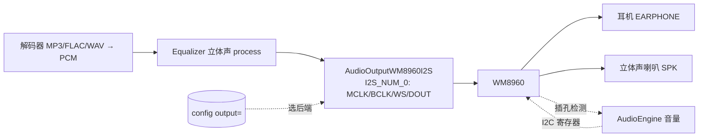

# Cardio — 外接 WM8960 立体声 Codec 实施计划

> **目标**：通过背后 **EXT 2.54-14P 排针**外接 Waveshare WM8960 Audio Board，拿到
> **真·立体声 + 耳放 + I2C 硬件音量 + 插孔自动切换**，一次解决内部单声道硬件的三个痛点。
>
> **设计原则**：可选、配置切换（`output=internal|wm8960`）。不接模块时默认走内部 ES8311
> 单声道，固件照常工作；接了模块并改配置才启用外部立体声路径。两条路径共存、互不破坏。
>
> 背景见 [ARCHITECTURE.md](ARCHITECTURE.md) 音频章、[CLAUDE.md](../CLAUDE.md) 音频约束。

---

## 0. 为什么 + 总览

- 内部 **ES8311 是单 DAC 单声道**（+ NS4150B 单声道功放 + 1 喇叭，耳机口共用这一路），
  硬件焊死，任何固件变不出立体声（详见 ARCHITECTURE）。
- **WM8960** = 立体声 codec：DAC **98dB**（超 CD 96dB）+ 耳放 **40mW@16Ω** + Class-D 喇叭
  **1W/ch@8Ω** + **I2C 控制** + **插孔检测**。一颗解决"耳机弱 / 数字音量掉位深 / 无插拔检测"三点。
- ESP32-S3 有两个 I2S：内部 ES8311 占 **I2S_NUM_1**，外接 WM8960 用空闲的 **I2S_NUM_0**；
  I2C 走共享总线（键盘/IMU 在 0x34/0x18，WM8960 在 **0x1A**，不冲突）。按配置二选一，不双开。

**数据流（output=wm8960）：**

对比当前 internal 路径：解码 → Equalizer **(L+R)/2 单声道** → AudioOutputM5Speaker → ES8311。

---

## 1. 硬件接线（EXT 排针）

WM8960 需要 **MCLK**（它的 SYSCLK 靠 MCLK 提供，不像 PCM5102A 能免 MCLK）→ I2S 共 **4 根**信号。

| WM8960 模块脚 | 接到 Cardputer | 说明 |
|---|---|---|
| VCC | EXT **3V3**（或 5V） | 3.3V 跑 codec + 耳机足矣；要满血 1W 喇叭则给 SPKVDD **5V**（EXT 有 5V）|
| GND | EXT GND | |
| **SDA** | **G8**（共享 I2C SDA） | 与键盘/IMU 同总线，WM8960@0x1A 不冲突 |
| **SCL** | **G9**（共享 I2C SCL） | |
| **MCLK** | 空闲 GPIO（建议 **G4**） | **必须**：ESP32 输出 256×fs 给 WM8960 当 SYSCLK |
| **BCLK**（板上 CLK） | 空闲 GPIO（建议 **G5**） | 位时钟 |
| **LRCK / WS** | 空闲 GPIO（建议 **G6**） | 帧时钟 |
| **DACDAT**（板上 TXSDA） | 空闲 GPIO（建议 **G13**） | 放音数据 ESP→WM8960 |
| ADCDAT（RXSDA） | 可不接 | 仅录音用 |

> ⚠️ **避开 G3**（strapping 脚）。以上 G4/G5/G6/G13 来自 EXT 引出的 G3/G4/G5/G6/G13/G15，
> 最终以 **EXT 丝印 / 官方 pinmap 为准**；ESP32-S3 GPIO 矩阵可任意改映射。
> Waveshare 板的 EARPHONE / SPK 口板载，HP 插孔检测应已接到 WM8960 GPIO1（购板后确认）。

---

## 2. 软件架构

### 2.1 输出后端抽象（核心改动）
`AudioEngine::begin()` 按 `cfg.output()` 选后端，**解码链不变**（`AudioFileSourceSD →
AudioGeneratorXXX → out`），只换最后的 `out`：

| output= | 后端类 | 行为 |
|---|---|---|
| `internal`（默认）| `AudioOutputM5Speaker` | ES8311 单声道，sqrt 音量曲线，(L+R)/2 下混（现状）|
| `wm8960` | `AudioOutputWM8960I2S`（新）| WM8960 立体声，I2C 硬件音量，**不下混** |

### 2.2 `AudioOutputWM8960I2S`（新类，audio/）
- 继承 ESP8266Audio 的 `AudioOutput`（与现有 `AudioOutputM5Speaker` 同套桥接模式）
- **底层用 ESP-IDF `i2s_std` 驱动**（I2S_NUM_0）做 **master**，显式配 **MCLK 引脚 + 256×fs**
  - 为什么自写而不直接用 ESP8266Audio 的 `AudioOutputI2S`：1.9.7 的 `AudioOutputI2S` 在 S3 上
    **MCLK 输出支持不确定**，而 WM8960 必须有 MCLK。自写 IDF I2S 类对 MCLK/引脚/采样率完全可控。
    （可先试 `AudioOutputI2S` + `SetPinout`，若 MCLK 出不来再落地自写类。）
- `ConsumeSample(s[2])`：`Equalizer::instance().process(s)`（**立体声，L/R 各自滤波**）→ 写 L,R 进 DMA
- `SetRate(hz)`：重配 I2S 时钟（含 MCLK=256·hz）+ 写 WM8960 采样率分频寄存器
- `begin/stop/flush`：DMA 起停 + 防 pop

### 2.3 WM8960 I2C 驱动（audio/WM8960.h/cpp）
- **移植 SparkFun WM8960 Arduino 库**（纯 I2C，用现有 `Wire` / G8-G9），或抽最小初始化序列
- 初始化寄存器序列（要点）：
  1. R15 复位
  2. 电源：R25/R26/R47 → 使能 VREF、DACL/R、LOUT1/ROUT1(耳放)、SPKL/R(喇叭)
  3. 时钟：R4 SYSCLK=MCLK，R8 设 DAC 采样率分频（对应 256×fs）
  4. 接口：R7 → I2S 格式、16-bit、**slave**
  5. R5 DAC 取消静音；R10/R11 DAC 音量
  6. 输出 mixer：R34/R37 把 DAC 路由到耳机 + 喇叭
  7. 耳机音量 R2/R3（LOUT1/ROUT1）
  8. Class-D 喇叭：R40 使能、R51 音量
  9. 插孔检测：R23/R24 + GPIO1 配置（自动切换）
  10. 防 pop 上电时序
- 库方法对应：`enableDAC / enableHeadphones / setHeadphoneVolume / enableSpeakers /
  setSpeakerVolume / enableJackDetect …`

### 2.4 音量（无位深损失，解决痛点②）
- **wm8960 路径**：`setVolume(0-21)` → 映射到 WM8960 **耳机/喇叭音量寄存器**（模拟域 dB 步进），
  **I2S 数据流保持满幅** → 0 位深损失。`gain` 上限概念 → 映射 WM8960 最大音量。
- internal 路径：沿用现有 sqrt 曲线（M5.Speaker 平方补偿）。
- 对外 `AudioEngine::setVolume()` API 不变，内部按当前后端分派。

### 2.5 立体声 EQ 回切（解决痛点：声道分离）
- wm8960 用 `Equalizer` **现成的 `process(int16_t s[2])`**（L/R 各自滤波，已实现），**不做下混**。
- `(L+R)/2 下混` 只保留在 `AudioOutputM5Speaker` 路径里——按后端天然分流，无需开关。

### 2.6 插孔检测（解决痛点③）
- WM8960 **自动 HP-detect**（GPIO1 检测耳机插入 → 自动静音喇叭 / 切路由），I2C 配置即可。
- 或读检测状态由固件切 → 恢复"插耳机自动停喇叭"，且比原机械开关更可控（可做淡入淡出）。

### 2.7 配置
- 新增 `Config` 键 **`output=internal|wm8960`**（默认 `internal`）。
- EXT 引脚定义放头文件常量（如 `audio/WM8960Pins.h`），带注释，便于按实际接线改。

---

## 3. 内存

- WM8960 I2C 驱动 ~几 KB；`AudioOutputWM8960I2S` 三缓冲 + I2S DMA ≈ 与 `AudioOutputM5Speaker` 相当。
- 同一时刻**只一个后端激活**（ES8311/I2S1 或 WM8960/I2S0），不双开 DMA。
- 整体影响小；与 BLE 共存仍按 [PLAN_UI_BLE.md](PLAN_UI_BLE.md) 的预算（开 BLE 后实测堆）。

---

## 4. 实施顺序

1. **硬件接线 + 上电自检**：I2C 扫描应能看到 **0x1A**
2. **WM8960 I2C 驱动**：复位 + 读寄存器 + 最小初始化，先用 IDF i2s 直接喂出 **1kHz 测试音**
3. **AudioOutputWM8960I2S**：接上 ESP8266Audio，放裸 PCM / WAV，**立体声**出耳机
4. **AudioEngine 后端切换**（`output=`）+ 立体声 EQ 路径 + I2C 音量映射
5. **插孔检测**
6. **双后端切换联调** + A/B（internal 单声道 ↔ wm8960 立体声）

---

## 5. 测试

- I2C 扫描确认 0x1A；写后读回寄存器校验
- **硬左右声道分离测试**：用硬 pan（一边乐器）音源 → 确认 L/R 真分开 ← **验证最初诉求**
- MP3/FLAC 立体声出耳机；与内部单声道 A/B
- 音量步进无 zipper 噪；低音量位深 OK
- 插/拔耳机 → 喇叭自动静音/恢复
- `heap` 监控稳定；切后端不崩

---

## 6. 风险

| 风险 | 等级 | 缓解 |
|---|---|---|
| ESP32-S3 MCLK 输出 / ESP8266Audio 支持不明 | **中-高** | 自写 IDF `i2s_std` 输出类，显式配 MCLK 引脚 + 256×fs |
| WM8960 初始化时序（pop / 时钟选择）finicky | 中 | 照 SparkFun 库移植，按手册防 pop 序列 |
| I2C 与键盘/IMU 共总线时序 | 低 | I2C 仲裁；WM8960 配置只在 begin 做，运行期仅偶发音量/插拔写 |
| EXT 实际引脚映射与建议不符 | 低 | 按 EXT 丝印 / 官方 pinmap 核对后再焊；GPIO 矩阵可改 |
| 喇叭满 1W 需 5V | 低 | SPKVDD 供 5V；只用耳机则 3.3V 即可 |
| 模块未把 HP-detect 接到 GPIO1 | 低 | 购板后确认；不行则用带开关的 3.5 座 + 一个 GPIO |

---

## 7. 工期（纯固件，不含等模块到货）

| 阶段 | 工期 |
|---|---|
| 硬件接线 + WM8960 I2C 驱动（出测试音）| 1–1.5d |
| AudioOutputWM8960I2S + MCLK 时钟 | 1–1.5d |
| 后端切换 + 立体声 EQ + I2C 音量 + 插孔检测 | 1d |
| 联调 + A/B | 0.5d |
| **合计** | **~4 工作日** |

---

## 8. 改动清单（与现有代码的关系）

**新增**
- `audio/AudioOutputWM8960I2S.h/cpp` — I2S_NUM_0 立体声输出（IDF i2s_std + MCLK）
- `audio/WM8960.h/cpp` — I2C 寄存器驱动（或引入 SparkFun 库）
- `audio/WM8960Pins.h` — EXT 引脚常量

**修改**
- `audio/AudioEngine.cpp/h` — `begin()` 按 `output=` 选后端；`setVolume/setGainCeiling` 按后端分派
- `config/Config.cpp/h` — 新增 `output` 键
- （EQ 调用处天然分流：wm8960 后端用 `process(s[2])`，M5Speaker 后端用 `processMono`，无需开关）

**不动**
- 解码链（AudioFileSourceSD / AudioGenerator*）、UI、PlaybackController、Equalizer 引擎本身

> 关联：此方案与 [PLAN_UI_BLE.md](PLAN_UI_BLE.md) 互不依赖，可并行；属**可选硬件增强**，
> 不接 WM8960 模块时 `output=internal` 一切照旧。
